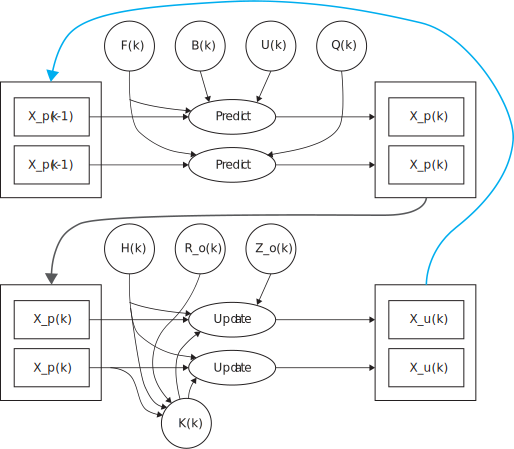
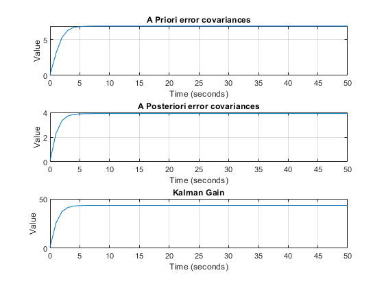
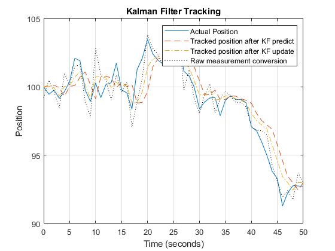

# Kalman Filter

## Problem 1 - 1D Kalman Filter

**Problem Statement:** 

Consider a sensor that is tracking the motion of an object that is a known distance (Do = 100 m) from the sensor. Let θ\_m  be the angle (in radians) that is measured by the sensor.

Suppose you know that the position of the object (in meters) is governed by the following equation of motion:

X(t+1) = X(t) + w(t)

where t is measured in seconds and w(t) is a random change in the position of the object (each second) that one assumes to be normally distributed around 0 with a standard deviation of 1.0 m. The relationship between the sensor output and the actual position of the object may be characterized as follows:

θ\_m (t) = X(t)/Do + v(t)

where v(t) is a random uncertainty in the measurement of θ(t) that is assumed to be normally distributed around 0 with a standard deviation of 0.010 radians.

We want to build a Kalman filter that will best predict the next location of the object and examine its characteristics with respect to the state estimation error covariance and sensor and process noise properties.

Suppose θ\_m (0) = 0.000 rad, θ\_m (1) = 0.010 rad, and θ\_m (2) = 0.020 rad.

<div><span class="image fit"></span></div>


---
**MATLAB Code:** [problem_1.m](./problem_1.m)

Author: Yash Bansod
Date: 2nd May, 2020
Problem 1 - 1D Kalman Filter

GitHub: https://github.com/YashBansod

### Clear the environment and the command line

```matlab
clear;
close all;
clc;
```

### Define the input parameters

```matlab
init_state = 100;               % Initial state
init_cov = 0.1;                 % Initial state covariance
Q = 3;                          % System Process Noise
R = 0.0009;                     % Measurement Noise
delta_t = 1;                    % Delta time
num_steps = 51;                 % Number of time steps (including t=0)
```

### Define the environment data

```matlab
% Define the actual position of the object over time.
X_a = random('Normal', 0, 1, 1, num_steps);
X_a(1) = init_state;
X_a = cumsum(X_a);

% Define the obtained sensor measurements over time.
theta_m = (X_a / init_state) + random('Normal', 0, 0.01, 1, num_steps);
% theta_m(1) = 0;
% theta_m(2) = 0.01;
% theta_m(3) = 0.02;

% Raw conversion of sensor measurement to object state
X_m = theta_m * init_state;
```

### Kalman Filter Variables

```matlab
F = 1;
H = 1/init_state;

X_p = zeros(1, num_steps);
X_p(1) = init_state;

P_p = zeros(1, num_steps);
P_p(1) = init_cov;

X_u = zeros(1, num_steps);
X_u(1) = init_state;

P_u = zeros(1, num_steps);
P_u(1) = init_cov;

K = zeros(1, num_steps);
K(1) = (P_p(1) * H') * inv((H * P_p(1) * H') + R);
```

### Kalman Filter Loop

```matlab
for step = 2:num_steps

    % Prediction Stage
    X_p(step) = F * X_u(step - 1);
    P_p(step) = (F * P_u(step - 1) * F') + Q;

    % Update Stage
    K(step) = (P_p(step) * H') * inv((H * P_p(step) * H') + R);
    X_u(step) = X_p(step) + (K(step) * (theta_m(step) - H * X_p(step)));
    P_u(step) = P_p(step) - (K(step) * H * P_p(step));

end
```

### Plot the results

```matlab
time_line = 0:delta_t:(num_steps - 1)* delta_t;

figure(1);
subplot(3, 1, 1)
plot(time_line, P_p);
grid on;
title('A Priori error covariances');
xlabel('Time (seconds)');
ylabel('Value');

subplot(3, 1, 2)
plot(time_line, P_u);
grid on;
title('A Posteriori error covariances');
xlabel('Time (seconds)');
ylabel('Value');

subplot(3, 1, 3)
plot(time_line, K);
grid on;
title('Kalman Gain');
xlabel('Time (seconds)');
ylabel('Value');


figure(2);
plot(time_line, X_a);
hold on;
grid on;
plot(time_line, X_p, '--');
plot(time_line, X_u, '-.');
plot(time_line, X_m, ':', 'Color', 'k');
title('Kalman Filter Tracking');
xlabel('Time (seconds)');
ylabel('Position');
legend('Actual Position', 'Tracked position after KF predict', ...
        'Tracked position after KF update', 'Raw measurement conversion');
```
<div><span class="image fit"></span></div>
<div><span class="image fit"></span></div>