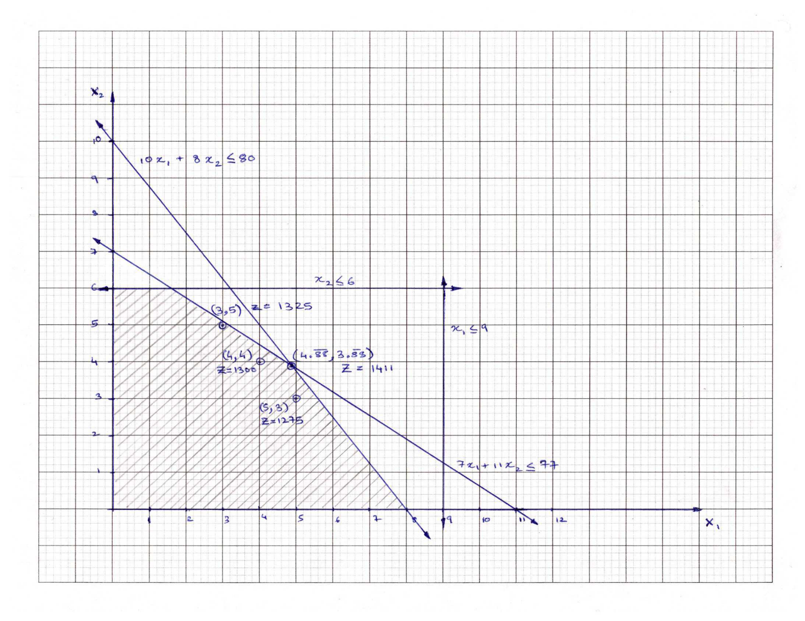

# Linear Programming 

## Problem 1 - Natural gas processing plant optimization

**Problem Statement:** 

A natural gas processing plant can produce two grades of gas: Regular and Premium. The production of these grades of gas involve availability and time constraints shown in the table below - note that only one type of gas can be produced at a time.

<div class="table-wrapper">
<table class="alt">
  <tr>
      <td><b>Resource</b></td> <td><b>Regular</b></td> <td><b>Premium</b></td> <td><b>Total Available</b></td>
  </tr> 
  <tr>
    <td><b>Feed gas required</b></td> <td> 7 m3/kg</td> <td> 11 m3/kg</td> <td> 77 m3/s </td>
  </tr> 
  <tr>
    <td><b>Production time</b></td> <td> 10 h/kg</td> <td> 8 h/kg</td> <td> 80 </td>
  </tr>
  <tr>
    <td><b>Max feed rate</b></td> <td>  9 kg/s</td> <td> 6 kg/s</td>
  </tr>
  <tr>
    <td><b>Profit</b></td> <td>150 cents/kg</td> <td> 175 cents/kg</td>
  </tr>
</table>
</div>

---

**Standard Form Representation:**

Let X1 and X2 be the flow rates of Regular and Premium gas, respectively, in kg/s.

Let Z be the overall profit made by the processing plant.

Therefore, the task is to maximize the following objective function:

max Z(X_1, X_2 ) = 150*X_1 + 175*X_2

Such that:

7\*X_1 + 11\*X_2 ≤ 77                (Feed gas constraint)

10\*X_1 + 8\*X_2 ≤ 80                (Production time constraint)

0 ≤ X_1 ≤ 9                        (Feed rate constraint 1)

0 ≤ X_2 ≤ 6                        (Feed rate constraint 2)

X_1, X_2 ∈ Z+                   (Optional positive integer value constraint)

<div><span class="image fit"></span></div>

**Linear Solution:**

X_1 = 4.88, X_2 = 3.88, Z = 1411

**Integer Solution:**

X_1 = 3, X_2 = 5, Z = 1325

**Solution Code:** [problem_1.m](./problem_1.m)


Author: Yash Bansod  
Date: 13th February, 2020  
Problem 1 - Natural gas processing plant optimization  

GitHub: https://github.com/YashBansod  

### Clear the environment and the command line

```matlab
clear;
clc;
```

### Define the optimization problem

```matlab
% Define the objective function
f = [-150 -175];

% Constraint matrix and vector (A*X <= B)
A = [7 11; 10 8; 1 0; 0 1];
B = [77; 80; 9; 6];

Aeq = [];
beq = [];
lb = zeros(2, 1);
ub = inf(2, 1);
```

### Find the solution

```matlab
% Compute the solution using linear programming
[X, fval] = linprog(f, A, B, Aeq, beq, lb, ub);

% print out the solution obtained using linear programming
fprintf('Solution using linear programming: X1 = %f, X2 = %f\n', X)
fprintf('Profit: %f\n\n', -fval)

% Compute the solution using integer programming
[X, fval] = intlinprog(f, [1 2], A, B, Aeq, beq, lb, ub);

% print out the solution obtained using integer programming
fprintf('Solution using integer programming: X1 = %d, X2 = %d\n', X)
fprintf('Profit: %d\n\n', -fval)
```
Solution using linear programming: X1 = 4.888889, X2 = 3.888889
Profit: 1413.888889

Solution using integer programming: X1 = 3.000000e+00, X2 = 5.000000e+00
Profit: 1325

---

## Problem 2 - Automobile Shop Optimization

You own of a shop producing automobile trailers and wish to determine the best mix for your three products: flat-bed trailers, economy trailers and luxury trailers. The shop is limited to working 24 days/month on metalworking and 60 days/month on woodworking for these products. This table indicates production data for trailers.

<div class="table-wrapper">
<table class="alt">
  <tr>
      <td></td> <td colspan="3"><b>Usage  per unit of trailer</b></td><td rowspan="2"><b>Resources</b></td> 
  </tr> 
  <tr>
    <td> </td> <td><b>Flat-Bed</b></td> <td><b>Economy</b></td> <td><b>Luxury</b></td>
  </tr> 
  <tr>
    <td><b>Metalworking</b></td> <td> 0.5</td> <td>2</td> <td> 1 </td><td>24</td>
  </tr>
  <tr>
    <td><b>Woodworking</b></td> <td>  1 </td> <td> 2</td> <td>4</td><td>60</td>
  </tr>
  <tr>
    <td><b>Value/Profit  ($ x 100)</b></td> <td>  6 </td> <td>14</td> <td> 13</td>
  </tr>
</table>
</div>

---

**Standard Form Representation:**

Let X1, X2, and X3 be the number of units to be produced of flat-bed trailers, economy trailers and luxury trailers respectively.

Let Z be the overall profit made by the production shop (as multiple of $100).

Therefore, the task is to maximize the following objective function:

max Z(X_1, X_2,X_3  ) = 6\*X_1 + 14\*X_2 + 13\*X_3

Such that:

0.5\*X_1 + 2\*X_2 + X_3 ≤ 24                  (Metalworking constraint)

X_1 + 2\*X_2 + 4\*X_3 ≤ 60                   (Woodworking constraint)

X_1, X_2, X_3 ∈ R+                           (Positive real value constraint)

X_1, X_2, X_3 ∈ Z+                           (Optional positive integer value constraint)

**Linear Solution:**

X_1 = 36, X_2 = 0, X_3 = 6, Z = 294

**Integer Solution:**

X_1 = 36, X_2 = 0, X_3 = 6, Z = 294

**Solution Code:** [problem_2a.m](./problem_2a.m)

Author: Yash Bansod  
Date: 13th February, 2020  
Problem 2a - Automobile Shop Optimization  

GitHub: https://github.com/YashBansod

### Clear the environment and the command line

```matlab
clear;
clc;
```

### Define the optimization problem

```matlab
% Define the objective function
f = [-6 -14 -13];

% Constraint matrix and vector (A*X <= B)
A = [0.5 2 1; 1 2 4];
B = [24; 60];

Aeq = [];
beq = [];
lb = zeros(3, 1);
ub = inf(3, 1);
```

### Find the solution

```matlab
% Compute the solution using linear programming
[X, fval] = linprog(f, A, B, Aeq, beq, lb, ub);

% print out the solution obtained using linear programming
sprintf('Solution using linear programming: X1 = %f, X2 = %f, X3 = %f', X)
sprintf('Profit: %f', -fval)

% Compute the solution using integer programming
[X, fval] = intlinprog(f, [1 2 3], A, B, Aeq, beq, lb, ub);

% print out the solution obtained using integer programming
sprintf('Solution using integer programming: X1 = %d, X2 = %d, X3 = %d', X)
sprintf('Profit: %d', -fval)
```
Solution using linear programming: X1 = 36.000000, X2 = 0.000000, X3 = 6.000000
Profit: 294.000000

Solution using integer programming: X1 = 36, X2 = 0, X3 = 6.000000e+00
Profit: 294

---

**Dual of Standard Form:**

Let Y1 and Y2 be the value (shadow price) of metalworking and woodworking resources.

Let W be the minimum acceptable price for the resources (as multiple of $100).

min W(Y_1, Y_2) = 24\*Y_1 + 60\*Y_2

Such that:

0.5*Y_1+Y_2≥6       or     -0.5*Y_1-Y_2≤6            (Resource value for flat-bed trailers)

2\*Y_1 + 2\*Y_2 ≥ 14  or     -2\*Y_1 - 2\*Y_2 ≤ 14        (Resource value for economy trailers)

Y_1 + 4\*Y_2 ≥ 13       or     -Y_1 - 4\*Y_2 ≤ 13         (Resource value for luxury trailers)

Y_1, Y_2 ∈ R+                                     (Positive real value constraint)

**Linear Solution:**

Y_1 = 11, Y_2 = 0.5, Z = 294

**Solution Code:** [problem_2b.m](./problem_2b.m)

Author: Yash Bansod  
Date: 13th February, 2020  
Problem 2b - Automobile Shop Optimization (Dual)  

GitHub: https://github.com/YashBansod

### Clear the environment and the command line

```matlab
clear;
clc;
```

### Define the optimization problem

```matlab
% Define the objective function
f = [24 60];

% Constraint matrix and vector (A*Y <= B)
A = [-0.5 -1; -2 -2; -1 -4];
B = [-6; -14; -13];

Aeq = [];
beq = [];
lb = zeros(2, 1);
ub = inf(2, 1);
```

### Find the solution

```matlab
% Compute the solution using linear programming
[Y, fval] = linprog(f, A, B, Aeq, beq, lb, ub);

% print out the solution obtained using linear programming
sprintf('Solution using linear programming: Y1 = %f, Y2 = %f', Y)
sprintf('Minimum acceptable price: %f', fval)
```
Solution using linear programming: Y1 = 11.000000, Y2 = 0.500000
Minimum acceptable price: 294.000000

---

