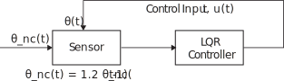
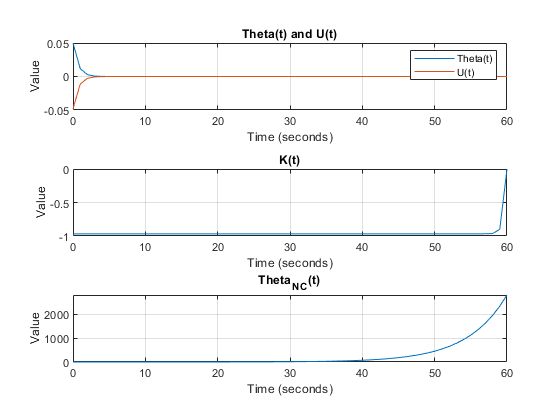

# Linear Quadratic Regulator

## Problem 1 - Linear Quadratic Regulator

**Problem Statement:** 

Consider a tracking sensor which in steady state tracks an object. Let θ(t) be the angle (in radians) between the direction the sensor is pointing, and the direction of the object being tracked. If the sensor loses the track (i.e., θ(t) ≠ 0), in the absence of any feedback control to return the sensor to the object, the sensor will reorient itself to a given reference orientation. Assume this behavior may be modeled using:

θ\_nc (t+1)= 1.2*θ\_nc (t).

where “nc” means “no control.”

We want to build a Linear Quadradic Regulator (LQR) that will optimally return the system to tracking an object given it has lost track. Note: the control input provides the correction required to bring the sensor back into track (e.g., from a Kalman Filter).

<div><span class="image fit"></span></div>


---
**MATLAB Code:** [problem_1.m](./problem_1.m)

Author: Yash Bansod
Date: 2nd May, 2020
Problem 1 - Linear Quadratic Regulator

GitHub: https://github.com/YashBansod


### Clear the environment and the command line

```matlab
clear;
close all;
clc;
```

### Define the input parameters

```matlab
init_theta = 0.05;
delta_t = 1;                     % Delta time
num_steps = 61;                     % Number of time steps (including t=0)

R = 1;
Q = 3;
```

### LQR computations

```matlab
theta = zeros(1, num_steps);
theta_nc = zeros(1, num_steps);
u = zeros(1, num_steps);
K = zeros(1, num_steps);
P = zeros(1, num_steps);

A = 1.2;
B = 1;

theta(1) = init_theta;
theta_nc(1) = init_theta;
P(end) = Q;

for t_step = num_steps:-delta_t:2
    P(t_step - 1) = Q + (A * P(t_step) * A') - (A' * P(t_step) * B * ...
        inv(R + B' * P(t_step) * B) * B' * P(t_step) * A);
end


for t_step = 1:delta_t:num_steps-1
    K(t_step) = -inv(R + B' * P(t_step + 1) * B) *  B' * P(t_step + 1) * A;
    u(t_step) = K(t_step) * theta(t_step);
    theta(t_step + 1) = A * theta(t_step) + B * u(t_step);
    theta_nc(t_step + 1) = A * theta_nc(t_step);
end
```

### Plot the results

```matlab
time_line = 0:delta_t:(num_steps - 1)* delta_t;

figure(1);

subplot(3, 1, 1)
plot(time_line, theta);
hold on;
grid on;
plot(time_line, u);
title('Theta(t) and U(t)');
xlabel('Time (seconds)');
ylabel('Value');
legend('Theta(t)', 'U(t)')

subplot(3, 1, 2)
plot(time_line, K);
grid on;
title('K(t)');
xlabel('Time (seconds)');
ylabel('Value');

subplot(3, 1, 3)
plot(time_line, theta_nc);
grid on;
title('Theta_N_C(t)');
xlabel('Time (seconds)');
ylabel('Value');
```

<div><span class="image fit"></span></div>

