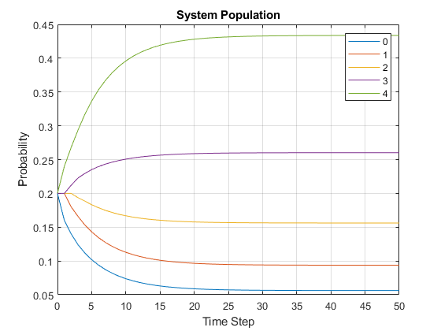
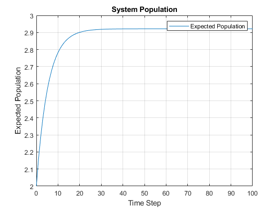
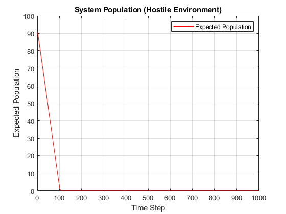
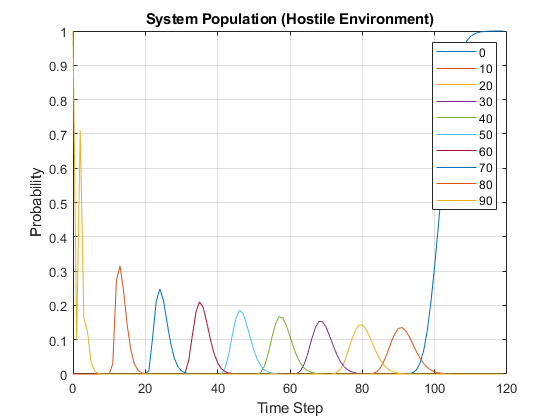
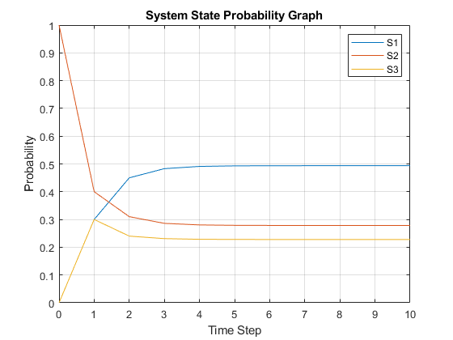
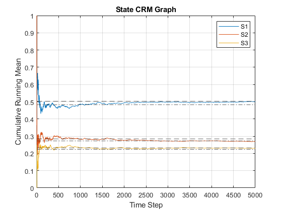
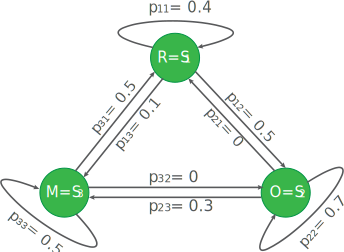
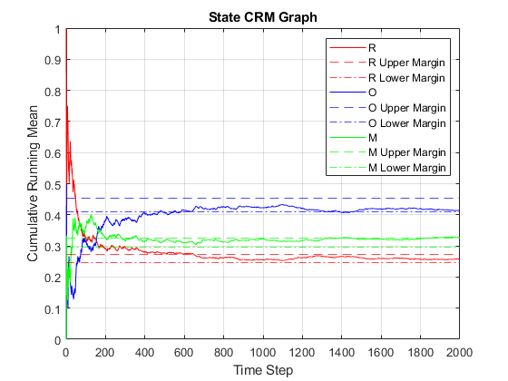

# Markov Processes

## [Problem 1a - Markov Birth-Death Process](./problem_1a.m)

**Problem Statement:** 

Consider a population of micro-organisms that can grow under certain favorable physical condition and similarly the population decrease under hostile situation. Also consider that due to space restriction the maximum number of members in the population could be N (and 0 as minimum). Let us denote the population size at time t by X_t. So, at any time t, X_t  will be one of the numbers from {0, 1, …, N}. The population growth (or death) rate depends on the current population size as follows:

p\_(n, n+1) = P(X\_(t+1)=n+1│X\_t=n) = λ_n  

p\_(n, n-1) = P(X\_(t+1)=n-1│X\_t=n) = μ_n  

p\_(n, n) = P(X\_(t+1)=n│X\_t=n) = 1 - λ\_n - μ\_n

λ\_N = μ\_0 = 0

Where P(X\_(t+1)=n+1│X\_t=n) is the probability that the population will increase by one in one time step.

<div><span class="image fit"></span></div>

a.  Let us consider N=4, λ\_n=0.5, μ\_n=0.3 for all n=0,1,2,…N along with the condition λ\_N = μ\_0 = 0 (i.e. probabilities do not depend on the population size), and the initial probabilities at time t=0 are given as p\_0(0) = p\_1(0) = p\_2(0) = p\_3(0) = p\_4(0) = 0.2 (uniformly distributed). Find (using MATLAB) p\_n(t)  for all n=0,1,…, N for t=1,2,…,50 and plot each p\_n(t) with time t. 

---

**MATLAB Code:** [problem_1a.m](./problem_1a.m)

Author: Yash Bansod  
Date: 26th March, 2020  
Problem 1a - Markov Birth-Death Process  

GitHub: https://github.com/YashBansod

### Clear the environment and the command line

```matlab
clear;
clc;
close all;
```

### Define the input parameters

```matlab
num_time_steps = 50;                    % Number of time steps
state_vec_size = 5;                     % N + 1; N = Maximum Population
states = {'0', '1', '2', '3', '4'};     % State Labels
assert(size(states, 2) == state_vec_size);

% Construct the birth rate vector. Vector is used to keep our code
% adaptable to varying birth rates for different states
birth_rate = 0.5;
birth_rate_vec = zeros(1, state_vec_size);
birth_rate_vec(1:end - 1) = birth_rate;

% Construct the death rate vector. Vector is used to keep our code
% adaptable to varying death rates for different states
death_rate = 0.3;
death_rate_vec = zeros(1, state_vec_size);
death_rate_vec(2:end) = death_rate;

% Construct the state matrix where each row represents the state vector at
% time step = row_index - 1
state_mat = zeros(num_time_steps + 1, state_vec_size);
state_mat(1, :) = 1/state_vec_size;     % Define the initial state vector

% Construct the state transition matrix
transition_mat = zeros(state_vec_size, state_vec_size);
for row_ind = 1:state_vec_size
    for col_ind = 1:state_vec_size
        if col_ind == row_ind - 1
            transition_mat(row_ind, col_ind) = death_rate_vec(row_ind);
        elseif col_ind == row_ind
            transition_mat(row_ind, col_ind) = 1 - ...
                (birth_rate_vec(row_ind) + death_rate_vec(row_ind));
        elseif col_ind == row_ind + 1
            transition_mat(row_ind, col_ind) = birth_rate_vec(row_ind);
        end
    end
end
```

### Compute the state vector at each time step

```matlab
for time_step = 2:num_time_steps+1
    state_mat(time_step, :) = state_mat(time_step - 1, :) * transition_mat;
end

% Sanity Check
transition_mat_ss = transition_mat^num_time_steps;
state_mat_ss = state_mat(1, :) * transition_mat_ss;
assert(all((state_mat_ss - state_mat(end, :)) < 1e-10));
```

### Plot the results

```matlab
time_line = 0:num_time_steps;
plot(time_line, state_mat(:, 1));
hold on;

for state_vec_ind = 2:state_vec_size
    plot(time_line, state_mat(:, state_vec_ind));
end
hold off;
legend(states);
title('System Population');
xlabel('Time Step');
ylabel('Probability');
grid on;
```

<div><span class="image fit"></span></div>


---

## [Problem 1b - Markov Birth-Death Process](./problem_1b.m)

b. Find the expected size of the population, E[X_t], for times t=0,1,2,…,100 and plot it. [Hint: if X is a random variable that takes values from x_1, x_2, …, x_m  with probabilities p_1, p_2, …, p_m  respectively then E[X] = ∑ x_i p_i].

---

**MATLAB Code:** [problem_1b.m](./problem_1b.m)


Author: Yash Bansod  
Date: 26th March, 2020  
Problem 1b - Markov Birth-Death Process  

GitHub: https://github.com/YashBansod

### Clear the environment and the command line

```matlab
clear;
clc;
close all;
```

### Define the input parameters

```matlab
num_time_steps = 100;                    % Number of time steps
state_vec_size = 5;                     % N + 1; N = Maximum Population

% Construct the birth rate vector. Vector is used to keep our code
% adaptable to varying birth rates for different states
birth_rate = 0.5;
birth_rate_vec = zeros(1, state_vec_size);
birth_rate_vec(1:end - 1) = birth_rate;

% Construct the death rate vector. Vector is used to keep our code
% adaptable to varying death rates for different states
death_rate = 0.3;
death_rate_vec = zeros(1, state_vec_size);
death_rate_vec(2:end) = death_rate;

% Construct the state matrix where each row represents the state vector at
% time step = row_index - 1
state_mat = zeros(num_time_steps + 1, state_vec_size);
state_mat(1, :) = 1/state_vec_size;     % Define the initial state vector

% Construct the state transition matrix
transition_mat = zeros(state_vec_size, state_vec_size);
for row_ind = 1:state_vec_size
    for col_ind = 1:state_vec_size
        if col_ind == row_ind - 1
            transition_mat(row_ind, col_ind) = death_rate_vec(row_ind);
        elseif col_ind == row_ind
            transition_mat(row_ind, col_ind) = 1 - ...
                (birth_rate_vec(row_ind) + death_rate_vec(row_ind));
        elseif col_ind == row_ind + 1
            transition_mat(row_ind, col_ind) = birth_rate_vec(row_ind);
        end
    end
end
```

### Compute the state vector at each time step

```matlab
for time_step = 2:num_time_steps+1
    state_mat(time_step, :) = state_mat(time_step - 1, :) * transition_mat;
end

% Sanity Check
transition_mat_ss = transition_mat^num_time_steps;
state_mat_ss = state_mat(1, :) * transition_mat_ss;
assert(all((state_mat_ss - state_mat(end, :)) < 1e-10));

expected_population_size = sum((0:state_vec_size-1) .* state_mat, 2);
```

### Plot the results

```matlab
time_line = 0:num_time_steps;
plot(time_line, expected_population_size);
legend('Expected Population');
title('System Population');
xlabel('Time Step');
ylabel('Expected Population');
grid on;
```

<div><span class="image fit"></span></div>

---

## [Problem 1c - Markov Birth-Death Process](./problem_1c.m)

a. Now consider that a hostile situation has occurred that decreases the probability of growth with time and increases probability of death with time as given below:

p\_(n, n+1) = P(X\_(t+1)=n+1│X\_t=n) = 0.9e^(-2t)

p\_(n, n-1) = P(X\_(t+1)=n-1│X\_t=n) = 0.9(1-e^(-2t))

p\_(n, n) = P(X\_(t+1)=n│X\_t=n) = 1 - p\_(n, n+1) - p\_(n, n-1)

λ\_N = μ\_0 = 0

Under this situation, it is expected that the population size will decrease. Take N=100, initial population is 90, and plot E[X_t]  for t=0,1,2,…,1000. Does E[X_t]  converge to zero?

---

**MATLAB Code:** [problem_1c.m](./problem_1c.m)

Author: Yash Bansod  
Date: 26th March, 2020  
Problem 1c - Markov Birth-Death Process  

GitHub: https://github.com/YashBansod

### Clear the environment and the command line

```matlab
clear;
clc;
close all;
```

### Define the input parameters

```matlab
num_time_steps = 1000;                    % Number of time steps
state_vec_size = 101;                     % N + 1; N = Maximum Population

% Construct the state matrix where each row represents the state vector at
% time step = row_index - 1
state_mat = zeros(num_time_steps + 1, state_vec_size);
state_mat(1, 91) = 1;                   % Define the initial state vector

time_step = 0;
exp_factor = exp(-2 * time_step);

% Define the birth rate
birth_rate_coeff = 0.9;
birth_rate = birth_rate_coeff * exp_factor;

% Define the death rate
death_rate_coeff = 0.9;
death_rate_1 = death_rate_coeff;
death_rate_2 = death_rate_coeff * exp_factor;
% death_rate = death_rate_1 - death_rate_2;

% Define the no state change rate
no_change_rate = 0.1;
```

### Some pre-computations to calculate the state transition matrix

```matlab
% Precomputations for calculating the state transition matrix
identity_mat = eye(state_vec_size, state_vec_size);

birth_rate_mat_0 = circshift(identity_mat, -1);
birth_rate_mat_0(end, 1) = 0;
% birth_rate = birth_rate_coeff * exp_factor;

death_rate_mat_0 = circshift(identity_mat, 1);
death_rate_mat_0(1, end) = 0;
death_rate_mat_1 = death_rate_mat_0 .* death_rate_1;
% death_rate_mat_2 = death_rate_mat_0 .* death_rate_2;
% death_rate_mat = death_rate_mat_1 - death_rate_mat_2;

no_change_mat = identity_mat .* no_change_rate;

transition_mat = zeros(state_vec_size, state_vec_size, num_time_steps);
% transition_mat(:, :, time_step) = no_change_mat + ...
%                                   death_rate_mat + birth_rate_mat;
```

### Compute the state vector at each time step

```matlab
for time_step = 1:num_time_steps
    exp_factor = exp(-2 * (time_step -1));

    birth_rate = birth_rate_coeff * exp_factor;
    death_rate_2 = death_rate_coeff * exp_factor;

    birth_rate_mat = birth_rate_mat_0 .* birth_rate;

    death_rate_mat_2 = death_rate_mat_0 .* death_rate_2;
    death_rate_mat = death_rate_mat_1 - death_rate_mat_2;

    % no_change_mat is modified to correct the edge conditions
    no_change_mat(1, 1) = 1 - birth_rate_mat(1, 2);
    no_change_mat(end, end) = 1 - death_rate_mat(end, end - 1);

    transition_mat(:, :, time_step) = no_change_mat + ...
        death_rate_mat + birth_rate_mat;

    state_mat(time_step + 1, :) = state_mat(time_step, :) * ...
        transition_mat(:, :, time_step);
end

expected_population_size = sum((0:state_vec_size-1) .* state_mat, 2);
```

### Plot the results

```matlab
time_line = 0:num_time_steps;
figure(1);
plot(time_line, expected_population_size, 'r');
legend('Expected Population');
title('System Population (Hostile Environment)');
xlabel('Time Step');
ylabel('Expected Population');
grid on;
```

<div><span class="image fit"></span></div>

### Auxiliary Plots

```matlab
ss_ind = 120;
plot_states = {'0', '10', '20', '30', '40', '50', '60', '70', '80', '90'};

figure(2);
plot(time_line(1:ss_ind), ...
    state_mat(1:ss_ind, str2double(plot_states(1)) + 1));
hold on;

for index = 2:size(plot_states, 2)
    plot(time_line(1:ss_ind), state_mat(1:ss_ind, ...
        str2double(plot_states(index)) + 1));
end

hold off;
legend(plot_states);
title('System Population (Hostile Environment)');
xlabel('Time Step');
ylabel('Probability');
grid on;
```

<div><span class="image fit"></span></div>

---

## [Problem 2 - Estimating parameters of a Markov Chain](./problem_2.m)

**Problem Statement:** 

In this problem you will develop a program that takes as input a time sequence of a Markov Chain transitions and outputs the transition probability matrix P. Recall that transition probability entries are estimated by the following empirical rule:

P\_ij = n\_ij/n\_i 

where n\_ij  is the number of transitions from state i to state j and n\_i  is the total number of transitions from state i to any state (including itself) in the given data sequence. For example, if the given data is AABAACBCBCACB where {A, B, C} are the set of the states, then P\_AC=2/5, P\_BC=2/3  and P\_CC=0 etc.

---

**MATLAB Code:** [problem_2.m](./problem_2.m)

Author: Yash Bansod  
Date: 26th March, 2020  
Problem 2 - Estimating parameters of a Markov Chain  

GitHub: https://github.com/YashBansod

### Clear the environment and the command line

```matlab
clear;
close all;
clc;
```

### Define the input parameters

```matlab
state_sequence = [1 2 4 12 4 4 2 12];
% state_sequence = [2 3 2 2 2 1 3 1 3 1 2 2 3 1 3 3 2 2 2 1 2 2 3 3 2 2 3 ...
%     2 2 3 3 2 2 2 1 1 2 1 3 1 1 1 1 2 1 3 2 1 3 3];
% state_sequence = "a b a c d a b d a c d b a a b d";
% Preprocessing to convert sting input to string array

if all(class(state_sequence) == 'string')
    state_sequence = state_sequence.split(' ')';
end

seq_len = size(state_sequence, 2);

unique_states = unique(state_sequence);
num_states = size(unique_states, 2);
state_map_ind = containers.Map(unique_states, 1:num_states);

% Convert unique states array to cell array of strings
if all(class(state_sequence) == 'double')
    states = strsplit(int2str(unique_states));
else
    states = cellstr(unique_states);
end
```

### Calculate the Transition Probability Matrix

```matlab
transition_count_mat = zeros(num_states, num_states);

for seq_ind = 1:seq_len - 1
    from_state =  state_sequence(seq_ind);
    to_state = state_sequence(seq_ind + 1);

    from_index = state_map_ind(from_state);
    to_index = state_map_ind(to_state);

    transition_count_mat(from_index, to_index) = ...
        transition_count_mat(from_index, to_index) + 1;
end

assert(sum(transition_count_mat, 'all') == seq_len - 1);

transition_probability_mat = transition_count_mat ./ ...
    sum(transition_count_mat, 2);

transition_probability_table = array2table(transition_probability_mat, ...
    'rowNames', states, 'VariableNames' , states);
```

### Print the Results

```matlab
disp('Transition Probability Table:');
disp(transition_probability_table);
```
Transition Probability Table:
<div class="table-wrapper">
<table class="alt">
		<tr>
			<td>&nbsp;</td> <td><b>1</b></td> <td><b>2</b></td> <td><b>4</b></td> <td><b>12</b></td>
		</tr>
		<tr>
			<td><b>1</b></td> <td>0</td> <td>1</td> <td>0</td> <td>0</td>
		</tr>
		<tr>
			<td><b>2</b></td> <td>0</td> <td>0</td> <td>0.5</td> <td>0.5</td>
		</tr>
		<tr>
			<td><b>4</b></td> <td>0</td> <td>0.333</td> <td>0.333</td> <td>0.333</td>
		</tr>
		<tr>
			<td><b>12</b></td> <td>0</td> <td>0</td> <td>1</td> <td>0</td>
		</tr>
</table>
</div>


---

## [Problem 3a - Simulating a Markov Chain using Monte Carlo](./problem_3a.m)

**Problem Statement:** 

By simulating a Markov chain we mean the Monte Carlo simulation discussed in the class where the input will be the transition probability matrix (P) and the initial state (s_0) and number of transitions (N), and the output will be a sequence of length N+1 of states in that Markov chain.

Note that here we want a time evolution of states not the distribution (π\_t or p\_t^n) over the time. 

---

**MATLAB Code:** [problem_3a.m](./problem_3a.m)

Author: Yash Bansod  
Date: 26th March, 2020  
Problem 3a - Simulating a Markov Chain using Monte Carlo  

GitHub: https://github.com/YashBansod

### Clear the environment and the command line

```matlab
clear;
close all;
clc;
```

### Define the input parmeters

```matlab
states = {'a', 'b'};
num_states = size(states, 2);

% transition_mat = [0.5 0.5; 0.5 0.5];
% transition_mat = [0 1; 1 0];
transition_mat = [0.3 0.7; 0.6 0.4];
assert(size(transition_mat, 1) == num_states);
assert(size(transition_mat, 2) == num_states);

init_state = 'a';

% num_transitions = 10;
num_transitions = 200;
```

### Monte Carlo Simulation to generate Markov Chain


```matlab
% Map state names to indices
state_map_ind = containers.Map(states, 1:num_states);

% create a cell array for holding generated state sequence
state_seq = cell(1, num_transitions + 1);
state_seq{1} = init_state;

trans_mat_cumsum = cumsum(transition_mat, 2);   % Compute thresholds
rand_draw = rand(1, num_transitions);           % Random numbers sampled

% Next State is selected based on random draw and computed thresholds
for t_index = 1:num_transitions
    state_cumsum = trans_mat_cumsum(state_map_ind(state_seq{t_index}), :);
    for s_index = 1:num_states
        if rand_draw(t_index) <= state_cumsum(s_index)
            state_seq(t_index + 1) = states(s_index);
            break;
        end
    end
end

string_state_seq = string(strjoin(state_seq));
```

### Print out the results

```matlab
disp("State Sequence: ")

per_line = 80;
pattern = sprintf('.{1,%d}', per_line);
print_str = regexp(string_state_seq, pattern, 'match');

fprintf('%s\n', print_str{:});

% disp(string_state_seq)
```
State Sequence: 
a b a b a b b b a b a a b a a b a a a a b a b a a b b a a a b a a b b a a a b a b a a b a b b a b a b b a b a b b b a b b a b b b a a b b a b a b a b b b b a b a a b a b b b b b b a a a b a b a b b a b a b a a b a b b b a b a b b b a b b a a a b b b a b a b b b a b a b a a b a b a b b a b a b a b a b a b b a b b a a b a a b b b a b a b a b b a a b a a b a b a a a b a b b b a b a b b b a b a b a a a

---

## [Problem 3b - Simulating a Markov Chain using Monte Carlo](./problem_3b.m)

b. Use the output sequence from problem 3a as an input to the code developed in Problem 2 and estimate the transition probability matrix as the sequence length is increased from 21 (i.e., 20 transitions) to 101 or even higher. What do you find?

---
**MATLAB Code:** [problem_3b.m](./problem_3b.m)

Author: Yash Bansod  
Date: 26th March, 2020  
Problem 3b - Simulating a Markov Chain using Monte Carlo  

GitHub: https://github.com/YashBansod

### Clear the environment and the command line

```matlab
clear;
close all;
clc;
```

### Define the input parameters

```matlab
states = {'a', 'b'};                % Add more states if you want here
% states = {'a', 'b', 'c'};           % Add more states if you want here
num_states = size(states, 2);       % N = Number of states

% N x N Transition Matrix
transition_mat = [0.3 0.7; 0.6 0.4];
% transition_mat = [0.3 0.5 0.2; 0.4 0.4 0.2; 0.7 0.15 0.15];
assert(size(transition_mat, 1) == num_states);
assert(size(transition_mat, 2) == num_states);

init_state = 'a';

% num_transitions = 20;
% num_transitions = 200;
num_transitions = 2000;
```

### Monte Carlo Simulation to generate Markov Chain

```matlab
% Map state names to indices
state_map_ind = containers.Map(states, 1:num_states);

% create a cell array for holding generated state sequence
state_seq = cell(1, num_transitions + 1);
state_seq{1} = init_state;

trans_mat_cumsum = cumsum(transition_mat, 2);   % Compute thresholds
assert(all(trans_mat_cumsum(:, end) == 1), "Sum of probabilities != 1")
rand_draw = rand(1, num_transitions);           % Random numbers sampled

% Next State is selected based on random draw and computed thresholds
for t_index = 1:num_transitions
    state_cumsum = trans_mat_cumsum(state_map_ind(state_seq{t_index}), :);
    for s_index = 1:num_states
        if rand_draw(t_index) <= state_cumsum(s_index)
            state_seq(t_index + 1) = states(s_index);
            break;
        end
    end
end
```

### Calculate the Transition Probability Matrix

```matlab
transition_count_mat = zeros(num_states, num_states);

for seq_ind = 1:num_transitions
    from_state =  state_seq{seq_ind};
    to_state = state_seq{seq_ind + 1};

    from_index = state_map_ind(from_state);
    to_index = state_map_ind(to_state);

    transition_count_mat(from_index, to_index) = ...
        transition_count_mat(from_index, to_index) + 1;
end

assert(sum(transition_count_mat, 'all') == num_transitions);

transition_probability_mat = transition_count_mat ./ ...
    sum(transition_count_mat, 2);

transition_probability_table = array2table(transition_probability_mat, ...
    'rowNames', states, 'VariableNames' , states);
```

### Print the Results

```matlab
disp('Transition Probability Table:');
disp(transition_probability_table);
```
Transition Probability Table:
<div class="table-wrapper">
<table class="alt">
		<tr>
			<td>&nbsp;</td> <td><b>a</b></td> <td><b>b</b></td>
		</tr>
		<tr>
			<td><b>a</b></td> <td>0.31702</td> <td>0.68298</td> 
		</tr>
		<tr>
			<td><b>b</b></td> <td>0.60472</td> <td>0.39528</td> 
		</tr>
</table>
</div>


---

## [Problem 4a - Simulating a Markov Chain using Monte Carlo](./problem_4a.m)

**Problem Statement:** 

Consider a Markov chain system that is defined by three states (S1, S2, S3). Let Π(k)= {π_i (k)}  be the probability state vector for the system after step k. Assume the system starts in S2 and is characterized by the following transition matrix:

<div class="table-wrapper">
<table class="alt">
		<tr>
			<td>0.6</td> <td>0.2</td> <td>0.2</td>
		</tr>
		<tr>
			<td>0.3</td> <td>0.4</td> <td>0.3</td> 
		</tr>
		<tr>
			<td>0.5</td> <td>0.3</td> <td>0.2</td> 
		</tr>
</table>
</div>

Solve the equation analytically for the (exact) Steady State probability state vector.

---

**MATLAB Code:** [problem_4a.m](./problem_4a.m)

Author: Yash Bansod  
Date: 26th March, 2020  
Problem 4a - Simulating a Markov Chain using Monte Carlo  

GitHub: https://github.com/YashBansod

### Clear the environment and the command line

```matlab
clear;
clc;
close all;
```

### Define the input parmeters

```matlab
num_time_steps = 10;                    % Number of time steps
state_vec_size = 3;
states = {'S1', 'S2', 'S3'};            % State Labels
assert(size(states, 2) == state_vec_size);

% Construct the state matrix where each row represents the state vector at
% time step = row_index - 1
state_mat = zeros(num_time_steps + 1, state_vec_size);
state_mat(1, :) = [0 1 0];              % Define the initial state vector

% Construct the state transition matrix
transition_mat = [  0.6 0.2 0.2;
                    0.3 0.4 0.3;
                    0.5 0.3 0.2];
```

### Compute the state vector at each time step

```matlab
for time_step = 2:num_time_steps+1
    state_mat(time_step, :) = state_mat(time_step - 1, :) * transition_mat;
end

% Sanity Check
transition_mat_ss = transition_mat^num_time_steps;
state_mat_ss = state_mat(1, :) * transition_mat_ss;
assert(all((state_mat_ss - state_mat(end, :)) < 1e-10));
```

### Plot the results

```matlab
time_line = 0:num_time_steps;
plot(time_line, state_mat(:, 1));
hold on;

for state_vec_ind = 2:state_vec_size
    plot(time_line, state_mat(:, state_vec_ind));
end
hold off;
legend(states);
title('System State Probability Graph');
xlabel('Time Step');
ylabel('Probability');
grid on;
```

<div><span class="image fit"></span></div>

### Print the results

```matlab
disp("Final system state:")
disp(array2table(state_mat(end, :),'VariableNames' , states));
```
Final system state:
<div class="table-wrapper">
<table class="alt">
		<tr>
			<td><b>S1</b></td> <td><b>S2</b></td> <td><b>S3</b></td> 
		</tr>
		<tr>
			<td>0.49367</td> <td>0.27848</td> <td>0.22785</td> 
		</tr>
</table>
</div>


---

## [Problem 4b - Simulating a Markov Chain using Monte Carlo](./problem_4b.m)

b. Write a Monte Carlo simulation for this system that will: 

  i. Plot the cumulative running mean for the fraction of time that the system is found in State 1.
  ii. Print out the total fraction of time the system spent in each state over the course of the run.

---

**MATLAB Code:** [problem_4b.m](./problem_4b.m)

Author: Yash Bansod  
Date: 26th March, 2020  
Problem 4b - Simulating a Markov Chain using Monte Carlo  

GitHub: https://github.com/YashBansod

### Clear the environment and the command line

```matlab
clear;
clc;
close all;
```

### Define the input parmeters

```matlab
states = {'S1', 'S2', 'S3'};            % State Labels
num_states = size(states, 2);           % N = Number of states

% N x N Transition Matrix
transition_mat = [  0.6 0.2 0.2;
                    0.3 0.4 0.3;
                    0.5 0.3 0.2];
assert(size(transition_mat, 1) == num_states);
assert(size(transition_mat, 2) == num_states);

init_state = 'S2';

num_transitions = 5000;

% Number of steps taken in analytic approach to reach steady state
analytic_ss_steps = 10;
ss_margin = 2;      % Steady state margin in percentage
```

### Monte Carlo Simulation to generate Markov Chain

```matlab
% Map state names to indices
state_map_ind = containers.Map(states, 1:num_states);

% create a cell array for holding generated state sequence
state_seq = cell(1, num_transitions + 1);
state_seq{1} = init_state;

% Construct the state matrix where each row represents the state vector at
% time step = row_index - 1
state_mat = zeros(num_transitions + 1, num_states);
state_mat(1, state_map_ind(init_state)) = 1;

trans_mat_cumsum = cumsum(transition_mat, 2);   % Compute thresholds
assert(all(trans_mat_cumsum(:, end) == 1), "Sum of probabilities != 1")
rand_draw = rand(1, num_transitions);           % Random numbers sampled

% Next State is selected based on random draw and computed thresholds
for t_index = 1:num_transitions
    state_cumsum = trans_mat_cumsum(state_map_ind(state_seq{t_index}), :);
    for s_index = 1:num_states
        if rand_draw(t_index) <= state_cumsum(s_index)
            state_mat(t_index + 1, s_index) = 1;
            state_seq(t_index + 1) = states(s_index);
            break;
        end
    end
end
```

### Some computations for analysis

```matlab
% Compute the CRM
crm_state_mat = cumsum(state_mat, 1);
divisor = 1:num_transitions + 1;
crm_state_mat = crm_state_mat ./ divisor';

% Compute the analytic steady state
transition_mat_ss = transition_mat^analytic_ss_steps;
state_mat_ss = state_mat(1, :) * transition_mat_ss;
```

### Plot the results

```matlab
% Plot CRM
time_line = 0:num_transitions;
plot(time_line, crm_state_mat(:, 1));
hold on;

for state_vec_ind = 2:num_states
    plot(time_line, crm_state_mat(:, state_vec_ind));
end

% Draw Steady State Margins
for state_vec_ind = 1:num_states
    yline((1 + (ss_margin/100)) * state_mat_ss(state_vec_ind), '--');
    yline((1 - (ss_margin/100)) * state_mat_ss(state_vec_ind), '-.');
end

hold off;
legend(states);
title('State CRM Graph');
xlabel('Time Step');
ylabel('Cumulative Running Mean');
grid on;
```

<div><span class="image fit"></span></div>

### Print the results

```matlab
disp("Final mean system state:")
disp(array2table(crm_state_mat(end, :),'VariableNames' , states));
```
Final system state:
<div class="table-wrapper">
<table class="alt">
		<tr>
			<td><b>S1</b></td> <td><b>S2</b></td> <td><b>S3</b></td> 
		</tr>
		<tr>
			<td>0.4995</td> <td>0.27035</td> <td>0.23015</td> 
		</tr>
</table>
</div>


---

## [Problem 5 - Simulating a Markov Chain using Monte Carlo](./problem_5.m)

You are presented with a system that has the following states: Ready (R), Operating (O), and Maintenance (M). Assume that over a period of one hour, the probability of going from R->O is 0.5, the probability of going from R->M is 0.1, the probability of going from O->M is 0.3, and the probability of going from M->R is 0.5. 

<div><span class="image fit"></span></div>

Write a MATLAB Monte Carlo program that will use the following input and provide the following output: 

- Input: Initial State, Transition Probabilities (pij), Number of hours (Nh)

- Output:       
  - Probability that the system will be in each state after Nh hours.
  - A graph of the cumulative running mean of the probability (frequency) that system will be in each state.

---

**MATLAB Code:** [problem_5.m](./problem_5.m)

Author: Yash Bansod  
Date: 18th April, 2020  
Problem 5 - Markov Processes  

GitHub: https://github.com/YashBansod

### Clear the environment and the command line

```matlab
clear;
close all;
clc;
```

### Define the input parmeters

```matlab
states = {'R', 'O', 'M'};               % List the uniques states here
num_states = size(states, 2);

% Define the state transition matrix
transition_mat = [  0.4     0.5     0.1;
                    0       0.7     0.3;
                    0.5     0       0.5];

assert(size(transition_mat, 1) == num_states);
assert(size(transition_mat, 2) == num_states);

init_state = 'R';                       % Mark the initial state

num_transitions = 2000;                  % Define the number of hours

% Provide the analytic steady state for comparison
state_mat_ss = [15/58 25/58 9/29];
ss_margin = 5;      % Steady state margin in percentage
```

### Monte Carlo Simulation to generate Markov Chain

```matlab
% Map state names to indices
state_map_ind = containers.Map(states, 1:num_states);

% create a cell array for holding generated state sequence
state_seq = cell(1, num_transitions + 1);
state_seq{1} = init_state;

% Construct the state matrix where each row represents the state vector at
% time step = row_index - 1
state_mat = zeros(num_transitions + 1, num_states);
state_mat(1, state_map_ind(init_state)) = 1;

trans_mat_cumsum = cumsum(transition_mat, 2);   % Compute thresholds
assert(all(trans_mat_cumsum(:, end) == 1), "Sum of probabilities != 1")
rand_draw = rand(1, num_transitions);           % Random numbers sampled

% Next State is selected based on random draw and computed thresholds
for t_index = 1:num_transitions
    state_cumsum = trans_mat_cumsum(state_map_ind(state_seq{t_index}), :);
    for s_index = 1:num_states
        if rand_draw(t_index) <= state_cumsum(s_index)
            state_mat(t_index + 1, s_index) = 1;
            state_seq(t_index + 1) = states(s_index);
            break;
        end
    end
end
```

### Some computations for analysis

```matlab
% Compute the CRM
crm_state_mat = cumsum(state_mat, 1);
divisor = 1:num_transitions + 1;
crm_state_mat = crm_state_mat ./ divisor';
```

### Plot the results

```matlab
color_list = {'r', 'b', 'g', 'm', 'c', 'y', 'k'};
legend_arr = cell(num_states, 3);
% Plot CRM
time_line = 0:num_transitions;
state_vec_ind = 1;
plot(time_line, crm_state_mat(:, state_vec_ind), 'Color', ...
    color_list{state_vec_ind},'DisplayName', states{state_vec_ind});
hold on;
u_legend = strcat(states(state_vec_ind), ' Upper Margin');
l_legend = strcat(states(state_vec_ind), ' Lower Margin');
yline((1 + (ss_margin/100)) * state_mat_ss(state_vec_ind), '--', ...
    'Color', color_list{state_vec_ind}, 'DisplayName', u_legend{1});
yline((1 - (ss_margin/100)) * state_mat_ss(state_vec_ind), '-.', ...
    'Color', color_list{state_vec_ind}, 'DisplayName', l_legend{1});


for state_vec_ind = 2:num_states
    plot(time_line, crm_state_mat(:, state_vec_ind), 'Color', ...
        color_list{state_vec_ind}, 'DisplayName', states{state_vec_ind});
    u_legend = strcat(states(state_vec_ind), ' Upper Margin');
    l_legend = strcat(states(state_vec_ind), ' Lower Margin');
    yline((1 + (ss_margin/100)) * state_mat_ss(state_vec_ind), '--', ...
        'Color', color_list{state_vec_ind}, 'DisplayName', u_legend{1});
    yline((1 - (ss_margin/100)) * state_mat_ss(state_vec_ind), '-.', ...
        'Color', color_list{state_vec_ind}, 'DisplayName', l_legend{1});
end

hold off;
legend

title('State CRM Graph');
xlabel('Time Step');
ylabel('Cumulative Running Mean');
grid on;
```

<div><span class="image fit"></span></div>

### Print the results

```matlab
disp("Final mean system state:")
disp(array2table(crm_state_mat(end, :),'VariableNames' , states));
```
Final system state:
<div class="table-wrapper">
<table class="alt">
		<tr>
			<td><b>R</b></td> <td><b>O</b></td> <td><b>M  </b></td> 
		</tr>
		<tr>
			<td>0.25737</td> <td>0.41529</td> <td>0.32734</td> 
		</tr>
</table>
</div>