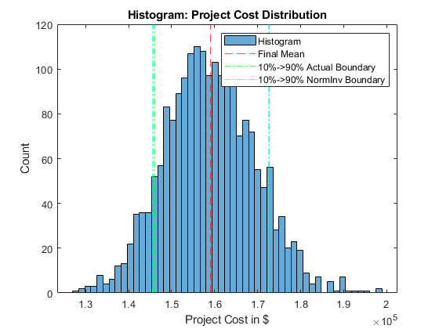
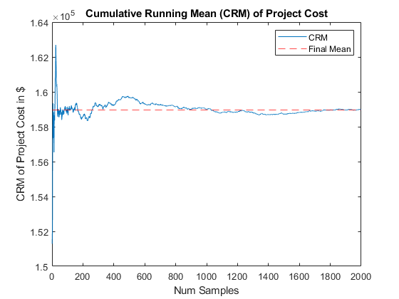
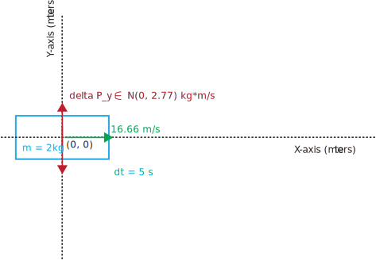
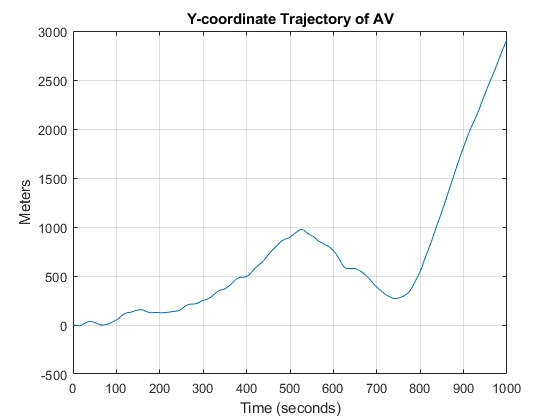
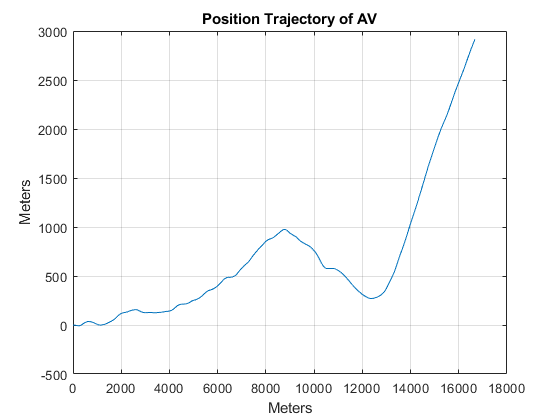
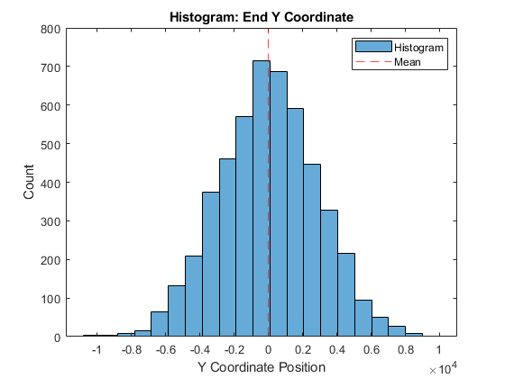

# Monte Carlo Simulation

## [Problem 1 - Static Monte Carlo Project Cost Simulation](./problem_1.m)

**Problem Statement:** 

Consider a Project that is characterized by the following activity edge table. The table indicates: 1) the activity names; 2) the associated event node names (numbers); 3) the  duration times (in days) for each activity; and 4) the hourly labor costs for each activity. Assume two people are required to complete each task and that each works 8 hours a day.

<div class="table-wrapper">
<table class="alt">
		<tr>
			<td rowspan=2><b>Activity</b></td> <td rowspan=2><b>Nodes</b></td> <td colspan=3><b>Duration Est (days)</b></td> <td colspan=3><b>Labor Cost ($/h)</b></td>
		</tr>
		<tr>
			<td></td><td></td><td><b>Min</b></td> <td><b>Max</b></td> <td><b>Likely</b></td> <td><b>Min</b></td> <td><b>Max</b></td> <td><b>Likely</b></td>
		</tr>
		<tr>
			<td>A</td> <td>1, 2</td> <td>4</td> <td>8</td> <td>6</td> <td>$100</td> <td>$150</td> <td>$120</td>
		</tr>
		<tr>
			<td>B</td> <td>1, 3</td> <td>2</td> <td>8</td> <td>4</td> <td>$100</td> <td>$150</td> <td>$120</td>
		</tr>
		<tr>
			<td>C</td> <td>2, 4</td> <td>1</td> <td>7</td> <td>3</td> <td>$100</td> <td>$150</td> <td>$120</td>
		</tr>
		<tr>
			<td>D</td> <td>3, 4</td> <td>6</td> <td>12</td> <td>9</td> <td>$100</td> <td>$150</td> <td>$120</td>
		</tr>
		<tr>
			<td>F</td> <td>3, 5</td> <td>5</td> <td>15</td> <td>10</td> <td>$100</td> <td>$150</td> <td>$120</td>
		</tr>
		<tr>
			<td>I</td> <td>3, 6</td> <td>10</td> <td>25</td> <td>15</td> <td>$100</td> <td>$150</td> <td>$120</td>
		</tr>
		<tr>
			<td>J</td> <td>4, 7</td> <td>5</td> <td>12</td> <td>9</td> <td>$90</td> <td>$110</td> <td>$100</td>
		</tr>
		<tr>
			<td>K</td> <td>5, 7</td> <td>1</td> <td>3</td> <td>2</td> <td>$90</td> <td>$110</td> <td>$100</td>
		</tr>
		<tr>
			<td>L</td> <td>6, 8</td> <td>2</td> <td>6</td> <td>3</td> <td>$90</td> <td>$110</td> <td>$100</td>
		</tr>
		<tr>
			<td>M</td> <td>7, 9</td> <td>10</td> <td>20</td> <td>15</td> <td>$90</td> <td>$110</td> <td>$100</td>
		</tr>
		<tr>
			<td>N</td> <td>8, 9</td> <td>6</td> <td>11</td> <td>9</td> <td>$90</td> <td>$110</td> <td>$100</td>
		</tr>
</table>
</div>


(Assume triangular distribution)

Use Monte Carlo simulation to calculate:

- mean total cost of the project
- the associated standard deviation
- the associated standard error in the mean
- the cumulative running mean (CRM)

---

**MATLAB Code:** [problem_1.m](./problem_1.m)

Author: Yash Bansod  
Date: 27th February, 2020  
Problem 1 - Static Monte Carlo Project Cost Simulation  

GitHub: https://github.com/YashBansod

### Clear the environment and the command line

```matlab
clear;
clc;
close all;
```

### Define the simulation parmeters

```matlab
num_samples = 2000;
num_hist_bins = 51;

activity =  {'A' 'B' 'C' 'D' 'F' 'I' 'J' 'K' 'L' 'M' 'N'};
num_activities = size(activity, 2);

min_hours = [64 32 16 96 80 160 80 16 32 160 96];
max_hours = [128 128 112 192 240 400 192 48 96 320 176];
likely_hours = [96 64 48 144 160 240 144 32 48 240 144];

min_cost = [100 100 100 100 100 100 90 90 90 90 90];
max_cost = [150 150 150 150 150 150 110 110 110 110 110];
likely_cost = [120 120 120 120 120 120 100 100 100 100 100];

% Some dimension checks to make sure values were inputted correctly
assert(size(min_hours, 2) == num_activities);
assert(size(max_hours, 2) == num_activities);
assert(size(likely_hours, 2) == num_activities);

assert(size(min_cost, 2) == num_activities);
assert(size(max_cost, 2) == num_activities);
assert(size(likely_cost, 2) == num_activities);
```

### Define the probability distributions to sample data from

```matlab
% Create probability distribution samplers for labor hours and cost
prob_dist_hours = cell(size(likely_hours));
prob_dist_cost = cell(size(likely_cost));

for ind = 1:num_activities
    prob_dist_hours{ind} = makedist('triangular', ...
        'a', min_hours(ind), 'b', likely_hours(ind), 'c', max_hours(ind));
    prob_dist_cost{ind} = makedist('triangular', ...
        'a', min_cost(ind), 'b', likely_cost(ind), 'c', max_cost(ind));
end
```

### Run the Monte-Carlo Simulation

```matlab
% rand('seed', 5);                    % Seed to control randomization
tic;

rand_hours = zeros(num_activities, num_samples);
rand_cost = zeros(num_activities, num_samples);

for ind = 1:num_activities
    rand_hours(ind, :) = random(prob_dist_hours{ind}, 1, num_samples);
    rand_cost(ind, :) = random(prob_dist_cost{ind}, 1, num_samples);
end

rand_task_cost = rand_hours .* rand_cost;

rand_proj_cost = sum(rand_task_cost, 1);
sample_range = 1:num_samples;
cum_run_mean_proj_cost = cumsum(rand_proj_cost) ./ sample_range;
mean_proj_cost = cum_run_mean_proj_cost(num_samples);

toc;

std_dev_proj_cost = std(rand_proj_cost);
std_err_proj_cost = std_dev_proj_cost / sqrt(num_samples);

% Calculate 10%ile and 90%ile of the collected dataset
percent_10 = prctile(rand_proj_cost, 10);
percent_90 = prctile(rand_proj_cost, 90);

% 10%ile & 90%ile assuming data is distributed as normal distribution.
norm_percent_10 = norminv(0.1, mean_proj_cost, std_dev_proj_cost);
norm_percent_90 = norminv(0.9, mean_proj_cost, std_dev_proj_cost);
Elapsed time is 0.004723 seconds.
```

### Plot the results

```matlab
figure(1)
histogram(rand_proj_cost, num_hist_bins);
hold on
xline(mean_proj_cost, '--r');
xline(percent_10, '-.g');
xline(norm_percent_10, '-.c');
xline(percent_90, '-.g');
xline(norm_percent_90, '-.c');
hold off
legend('Histogram', 'Final Mean', ...
    '10%->90% Actual Boundary', '10%->90% NormInv Boundary');
title('Histogram: Project Cost Distribution');
xlabel('Project Cost in $');
ylabel('Count');

figure(2)
plot(sample_range, cum_run_mean_proj_cost);
hold on
yline(mean_proj_cost, '--r');
hold off
legend('CRM', 'Final Mean');
title('Cumulative Running Mean (CRM) of Project Cost');
xlabel('Num Samples');
ylabel('CRM of Project Cost in $');
```

<div><span class="image fit"></span></div>
<div><span class="image fit"></span></div>

### Print the computation results

```matlab
fprintf('Project Cost - Mean: %.2f\n', mean_proj_cost);
fprintf('Project Cost - Standard Deviation: %.2f\n', std_dev_proj_cost)
fprintf('Project Cost - Standard Error: %.2f\n', std_err_proj_cost)
fprintf('Project Cost - 10%% -> 90%% Boundary: (%.2f, %.2f)\n',...
    percent_10, percent_90);
fprintf('Project Cost - 10%% -> 90%% Norm Inv Boundary: (%.2f, %.2f)\n',...
    norm_percent_10, norm_percent_90);
```
Project Cost - Mean: 158972.94  
Project Cost - Standard Deviation: 10503.04  
Project Cost - Standard Error: 234.86  
Project Cost - 10% -> 90% Boundary: (145860.56, 172652.69)  
Project Cost - 10% -> 90% Norm Inv Boundary: (145512.75, 172433.14)  


---


## [Problem 2a - Time-Driven Dynamic MC Simulation of an AV](./problem_2a.m)

Consider an autonomous vehicle (AV) attempting to move in the “X direction” subject to random gusts of wind (blowing in the +/- Y direction). Assume the AV has a mass of 2 kg and is traveling at a speed of 60 km/h. Assume that the impulse (change in momentum) imparted to the AV by the wind gusts over a period of 5 seconds is characterized by a normal distribution with a mean of 0 kg km/h and a standard deviation of 10 kg km/hr.

<div class="6u$"><span class="image fit"></span></div>

a. Develop and submit a MATLAB program that: 

1. Accepts the speed and mass of the      AV, the time step size, the mean and standard deviation of the impulse      delivered to the AV, the duration of the simulation (Ts), and number of      bins. All units should be converted to MKS.
2. Provides the following output: 
   i. The final location of the AV (at t = Ts).
   ii. A 2-D plot of the trajectory of AV (at dt time intervals).

---

**MATLAB Code:** [problem_2a.m](./problem_2a.m)

Author: Yash Bansod  
Date: 27th February, 2020  
Problem 2a - Time-Driven Dynamic MC Simulation of an AV  

GitHub: https://github.com/YashBansod

### Clear the environment and the command line

```matlab
clear;
clc;
close all;
```

### Define the simulation parmeters

```matlab
num_samples = 1;

sim_time_len = 1000;
time_step = 5;
num_t_steps = floor(sim_time_len/time_step);

mass_av = 2;
init_v_x = 16.6666;             % Initial velocity of AV in x-axis
init_v_y = 0;                   % Initial velocity of AV in y-axis

init_s_x = 0;                   % Initial position of AV in x-axis
init_s_y = 0;                   % Initial position of AV in y-axis

delta_p_y_mean = 0;             % Mean of Change in momentum
delta_p_std = 2.7777;           % Standard deviation of change in momentum
```

### Define the probability distributions to sample data from

```matlab
delta_v_y_mean = delta_p_y_mean/mass_av;
delta_v_y_std = delta_p_std/mass_av;

delta_v_y_dist = makedist('Normal', 'mu', ...
    delta_v_y_mean, 'sigma', delta_v_y_std);
```

### Run the Monte-Carlo Simulation

```matlab
% x-axis velocity trajectory of the AV
v_x = zeros(num_samples, num_t_steps + 1);
v_x(:, :) = init_v_x;

% x-axis position trajectory of the AV
delta_s_x = v_x(:, 1:end - 1) .* time_step;
s_x = zeros(num_samples, num_t_steps + 1);
s_x(:, 1) = init_s_x;
s_x(:, 2:end) = delta_s_x;
s_x = cumsum(s_x, 2);

tic;

% y-axis velocity trajectory of the AV
delta_v_y = random(delta_v_y_dist, num_samples, num_t_steps);
v_y = zeros(num_samples, num_t_steps + 1);
v_y(:, 1) = init_v_y;
v_y(:, 2:end) = delta_v_y;
v_y = cumsum(v_y, 2);

% y-axis positioin trajectory of the AB
delta_s_y = v_y(:, 1:end - 1) .* time_step + 0.5 * delta_v_y .* time_step;
s_y = zeros(num_samples, num_t_steps + 1);
s_y(:, 1) = init_s_y;
s_y(:, 2:end) = delta_s_y;
s_y = cumsum(s_y, 2);

end_y_cord = s_y(:, end);

toc;
Elapsed time is 0.000832 seconds.
```

### Plot the results

```matlab
figure(1)
plot(0:time_step:sim_time_len, s_y);
grid on;
title('Y-coordinate Trajectory of AV');
xlabel('Time (seconds)');
ylabel('Meters');

figure(2)
plot(s_x, s_y);
grid on;
title('Position Trajectory of AV');
xlabel('Meters');
ylabel('Meters');
```
<div><span class="image fit"></span></div>
<div><span class="image fit"></span></div>

### Print the computation results

```matlab
fprintf('Final Position Coordinate: (%.2f, %.2f)\n', s_x(end), s_y(end));
fprintf('Final Velocity: (%.2f, %.2f)\n', v_x(end), v_y(end));
```
Final Position Coordinate: (16666.60, 2914.33)
Final Velocity: (16.67, 10.74)


---


## [Problem 2b - Time-Driven Dynamic MC Simulation of an AV](./problem_2b.m)

b. Develop and submit a MATLAB program that: 

1. Accepts the speed and mass of the AV, the time step size, the mean and standard deviation of the impulse delivered to the AV, the duration of the simulation (Ts), the number of samples (Ns), and number of bins (Nb). All units should be converted to MKS.

2. Provides the following output: 

  i. The mean ending Y coordinate (in m), its associated standard deviation, and standard error in the mean.
  ii. A histogram graph showing the distribution of ending Y locations.

---

**MATLAB Code:** [problem_2b.m](./problem_2b.m)

Author: Yash Bansod  
Date: 27th February, 2020  
Problem 2b - Time-Driven Dynamic MC Simulation of an AV  

GitHub: https://github.com/YashBansod

### Clear the environment and the command line

```matlab
clear;
clc;
close all;
```

### Define the simulation parameters

```matlab
num_samples = 5000;
num_hist_bins = 21;

sim_time_len = 400;
time_step = 5;
num_t_steps = floor(sim_time_len/time_step);

mass_av = 2;
init_v_x = 16.6666;             % Initial velocity of AV in x-axis
init_v_y = 0;                   % Initial velocity of AV in y-axis

init_s_x = 0;                   % Initial position of AV in x-axis
init_s_y = 0;                   % Initial position of AV in y-axis

delta_p_y_mean = 0;             % Mean of Change in momentum
delta_p_std = 2.7777;           % Standard deviation of change in momentum
```

### Define the probability distributions to sample data from

```matlab
delta_v_y_mean = delta_p_y_mean/mass_av;
delta_v_y_std = delta_p_std/mass_av;

delta_v_y_dist = makedist('Normal', 'mu', ...
    delta_v_y_mean, 'sigma', delta_v_y_std);
```

### Run the Monte-Carlo Simulation

```matlab
% x-axis velocity trajectory of the AV
v_x = zeros(num_samples, num_t_steps + 1);
v_x(:, :) = init_v_x;

% x-axis position trajectory of the AV
delta_s_x = v_x(:, 1:end - 1) .* time_step;
s_x = zeros(num_samples, num_t_steps + 1);
s_x(:, 1) = init_s_x;
s_x(:, 2:end) = delta_s_x;
s_x = cumsum(s_x, 2);

tic;

% y-axis velocity trajectory of the AV
delta_v_y = random(delta_v_y_dist, num_samples, num_t_steps);
v_y = zeros(num_samples, num_t_steps + 1);
v_y(:, 1) = init_v_y;
v_y(:, 2:end) = delta_v_y;
v_y = cumsum(v_y, 2);

% y-axis positioin trajectory of the AB
delta_s_y = v_y(:, 1:end - 1) .* time_step + 0.5 * delta_v_y .* time_step;
s_y = zeros(num_samples, num_t_steps + 1);
s_y(:, 1) = init_s_y;
s_y(:, 2:end) = delta_s_y;
s_y = cumsum(s_y, 2);

end_y_cord = s_y(:, end);
mean_end_y_cord = mean(end_y_cord);
std_dev_end_y_cord = std(end_y_cord);
std_err_end_y_cord = std_dev_end_y_cord / sqrt(num_samples);

toc;
```
Elapsed time is 0.017619 seconds.

### Plot the results

```matlab
figure(1)
histogram(end_y_cord, num_hist_bins);
hold on
xline(mean_end_y_cord, '--r');
hold off
legend('Histogram', 'Mean');
title('Histogram: End Y Coordinate');
xlabel('Y Coordinate Position');
ylabel('Count');
```

<div><span class="image fit"></span></div>

### Print the computation results

```matlab
fprintf('Final Y-Coordinate - Mean: %.2f\n', mean_end_y_cord)
fprintf('Final Y-Coordinate - Standard Deviation: %.2f\n', ...
    std_dev_end_y_cord)
fprintf('Final Y-Coordinate - Standard Error: %.2f\n', std_err_end_y_cord)
```
Final Y-Coordinate - Mean: 12.63  
Final Y-Coordinate - Standard Deviation: 2855.95  
Final Y-Coordinate - Standard Error: 40.39  
