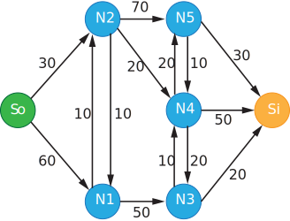
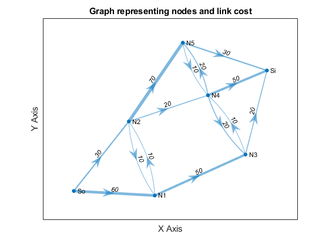
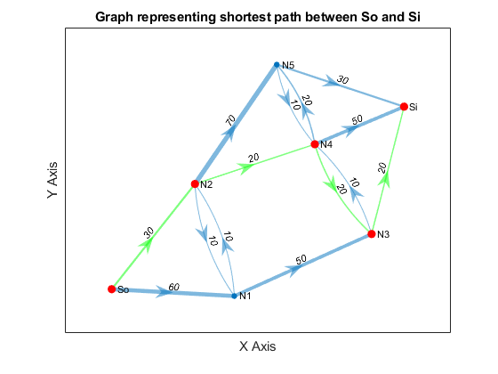
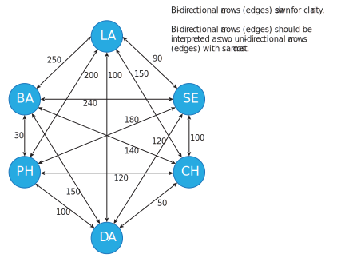
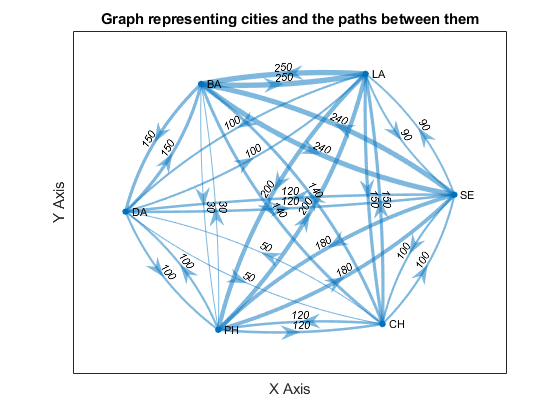
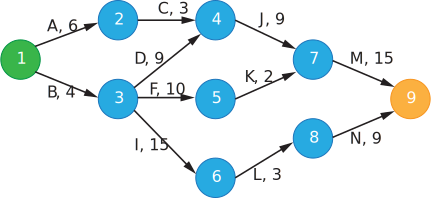
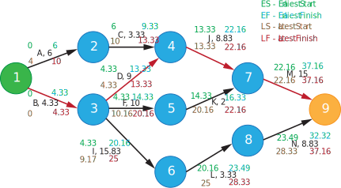
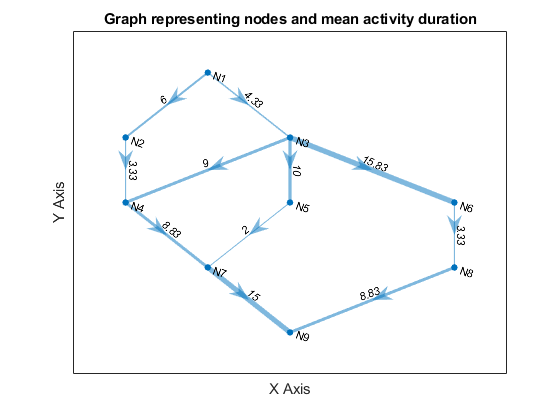
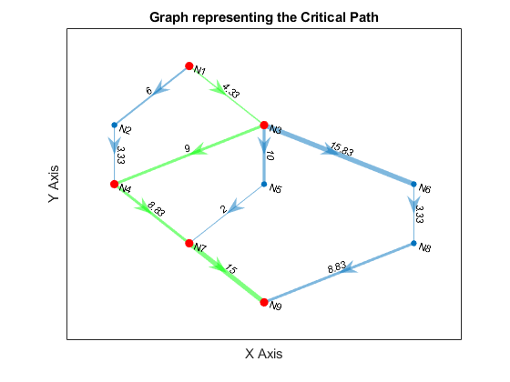
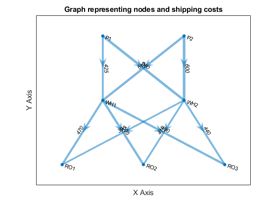

# Networks & Integer Programming

## [Problem 1 - Networks & Shortest Path](./problem_1.m)

**Problem Statement:** 

Suppose you need to write a routing algorithm for a communications network that will route traffic through an internetwork of networks (Ni) at the lowest possible cost. Your manager wants to know the least cost path between Source (So) and Sink (Si). Consider a communications network that is characterized by the following link costs.

<div class="table-wrapper">
<table class="alt">
	<tbody>
		<tr>
			<td><b>Link</b></td> <td><b>Cost ($/Tb)</strong></p></td> <td><b>Link</b></td> <td><b>Cost ($/Tb)</strong></p></td> <td><b>Link</b></td> <td><b>Cost ($/Tb)</strong></p></td>
		</tr>
		<tr>
			<td>So-N1</td> <td>60</td> <td>N2-N4</td> <td>20</td> <td>N5-N4</td> <td>10</td>
		</tr>
		<tr>
			<td>So-N2</td> <td>30</td> <td>N2-N5</td> <td>70</td> <td>N3 -Si</td> <td>20</td>
		</tr>
		<tr>
			<td>N1-N2</td> <td>10</td> <td>N3-N4</td> <td>10</td> <td>N4-Si</td> <td>50</td>
		</tr>
		<tr>
			<td>N2-N1</td> <td>10</td> <td>N4-N3</td> <td>20</td> <td>N5-Si</td> <td>30</td>
		</tr>
		<tr>
			<td>N1-N3</td> <td>50</td> <td>N4-N5</td> <td>20</td> <td>&nbsp;</td> <td>&nbsp;</td>
		</tr>
	</tbody>
</table>
</div>


<div class="6u$"><span class="image fit"></span></div>


---

**MATLAB Code: ** [problem_1.m](./problem_1.m)

Author: Yash Bansod
Date: 19th February, 2020
Problem 1 - Networks & Shortest Path

GitHub: https://github.com/YashBansod

### Clear the environment and the command line

```matlab
clear;
clc;
close all;
```

### Define the graph

```matlab
% Specify the node names
n_names = {'So', 'N1', 'N2', 'N3', 'N4', 'N5', 'Si'};

% Specify the edges and thier costs
e_start = [1 1 2 3 2 3 3 4 5 5 6 4 5 6];
e_stop  = [2 3 3 2 4 5 6 5 4 6 5 7 7 7];
e_cost  = [6 3 1 1 5 2 7 1 2 2 1 2 5 3] * 10;
% e_cost  = [60 30 10 10 50 20 70 10 20 20 10 20 50 30];

% Some dimension checks to make sure values were inputted correctly
assert(size(e_start, 2) == size(e_stop, 2));
assert(size(e_start, 2) == size(e_cost, 2));

% Create the graph
graph = digraph(e_start, e_stop, e_cost, n_names);
```

### Plotting the graph to visualize it better

```matlab
figure('Name', 'Problem graph')
p_g_plot = plot(graph, ...
    'EdgeLabel', graph.Edges.Weight, ...
    'LineWidth', 4 * graph.Edges.Weight / max(graph.Edges.Weight), ...
    'ArrowSize', 15);
title('Graph representing nodes and link cost')
xlabel('X Axis')
ylabel('Y Axis')
```
<div><span class="image fit"></span></div>

### Calculate and plot the shortest path

```matlab
[shortest_path, path_len] = shortestpath(graph, 'So', 'Si');
figure('Name', 'Shortest Path - Graph')
s_g_plot = plot(graph, ...
    'EdgeLabel', graph.Edges.Weight, ...
    'LineWidth', 4 * graph.Edges.Weight / max(graph.Edges.Weight), ...
    'ArrowSize', 15);
highlight(s_g_plot, shortest_path, 'MarkerSize', 6, ...
    'NodeColor', 'r', 'EdgeColor', 'g');
title(sprintf('Graph representing shortest path between %s and %s', ...
    'So', 'Si'))
xlabel('X Axis')
ylabel('Y Axis')
```

<div><span class="image fit"></span></div>

### Print the computation results

```matlab
disp(strcat(sprintf('Shortest path sequence: %s', shortest_path{1}), ...
    sprintf(' -> %s', shortest_path{2:end})))
fprintf('Shortest path cost: %d $/Tb\n', path_len
```
Shortest path sequence: So -> N2 -> N4 -> N3 -> Si  
Shortest path cost: 90 $/Tb  

---

  

## [Problem 2 - Transshipment/Production Problem](./problem_2.m)

**Problem Statement:** 

Suppose that you have two plants that manufacture drones, one in Chicago and one in Dallas. Suppose the Chicago plant can produce a maximum of 100 drones per week and the Dallas Plant can produce 200 drones/week. Suppose there are two major markets you serve, one in LA and the other in Baltimore. Suppose that the demand for drones in LA is 120 and the demand in Baltimore is 160 (drones per week).

Suppose there are the following per drone costs associated with shipping drones from one city to another (assume costs are symmetric (i.e. Cost i→j = Cost j→i):

<div class="table-wrapper">
<table class="alt">
	<tbody>
		<tr>
			<td>&nbsp;</td> <td colspan=6><b>To</b></td>
		</tr>
		<tr>
			<td><b>From</b></td> <td><b>Los Angeles (LA)</b></td> <td><b>Seattle (SA)</b></td> <td><b>Chicago (CH)</b></td> <td><b>Dallas (DA)</b></td> <td><b>Philadelphia (PH)</b></td> <td><b>Baltimore (BA)</b></td>
		</tr>
		<tr>
			<td><b>LA</b></td> <td>-</td> <td>$90</td> <td>$150</td> <td>$100</td> <td>$200</td> <td>$250</td>
		</tr>
		<tr>
			<td><b>Seattle (SA)</b></td> <td>&nbsp;</td> <td>-</td> <td>$100</td> <td>$120</td> <td>$180</td> <td>$240</td>
		</tr>
		<tr>
			<td><b>Chicago (CH)</b></td> <td>&nbsp;</td> <td>&nbsp;</td> <td>-</td> <td>$50</td> <td>$120</td> <td>$140</td>
		</tr>
		<tr>
			<td><b>Dallas (DA)</b></td> <td>&nbsp;</td> <td>&nbsp;</td> <td>&nbsp;</td> <td>-</td> <td>$100</td> <td>$150</td>
		</tr>
		<tr>
			<td><b>Philadelphia (PH)</b></td> <td>&nbsp;</td> <td>&nbsp;</td> <td>&nbsp;</td> <td>&nbsp;</td> <td>-</td> <td>$30</td>
		</tr>
		<tr>
			<td><b>Baltimore (BA)</b></td> <td>&nbsp;</td> <td>&nbsp;</td> <td>&nbsp;</td> <td>&nbsp;</td> <td>&nbsp;</td> <td>-</td>
		</tr>
	</tbody>
</table>
</div>

<div class="6u$"><span class="image fit"></span></div>

**Standard Form Representation:**

Let X_B^A  represent the number of drones shipped (per week) from city A to city B.

Let C_B^A  represent the minimum cost of shipping a drone (single unit) from city A to city B.

Let Z represent the total cost of shipping incurred.

Then the objective function is the following:

min Z(X_LA^CH, X_BA^CH, X_LA^DA, X_BA^DA) = X_LA^CH\*C_LA^CH + X_BA^CH\*C_BA^CH + X_LA^DA \*C_LA^DA + X_BA^DA\*C_BA^DA

Such that:

X_LA^CH + X_BA^CH ≤ 100

X_LA^DA + X_BA^DA ≤ 200

X_LA^CH + X_LA^DA = 120

X_BA^CH + X_BA^DA = 160

X_B^A ∈ Z(0,+), A ∈ {CH, DA}, B ∈ {LA, BA}

---

**MATLAB Code: ** [problem_2.m](./problem_2.m)

Author: Yash Bansod
Date: 19th February, 2020
Problem 2 - Transshipment/Production Problem

GitHub: https://github.com/YashBansod

### Clear the environment and the command line

```matlab
clear;
clc;
close all;
```

### Define the graph

```matlab
% Specify the node names
n_names = {'LA', 'SE', 'CH', 'DA', 'PH', 'BA'};

% Specify the edges and thier costs
e_start = [ 1 1 1 1 1;
            2 2 2 2 2;
            3 3 3 3 3;
            4 4 4 4 4;
            5 5 5 5 5;
            6 6 6 6 6]';
e_start = e_start(:)';

e_stop  = [ 2 3 4 5 6;
            1 3 4 5 6;
            1 2 4 5 6;
            1 2 3 5 6;
            1 2 3 4 6;
            1 2 3 4 5]';
e_stop = e_stop(:)';

e_cost  = [ 90 150 100 200 250;
            90 100 120 180 240;
            150 100 50 120 140;
            100 120 50 100 150;
            200 180 120 100 30;
            250 240 140 150 30]';
e_cost = e_cost(:)';

% Some dimension checks to make sure values were inputted correctly
assert(size(e_start, 2) == size(e_stop, 2));
assert(size(e_start, 2) == size(e_cost, 2));

% Create the graph
graph = digraph(e_start, e_stop, e_cost, n_names);
```

### Plotting the graph to visualize it better

```matlab
figure('Name', 'Shortest Path - Graph')
g_plot = plot(graph, ...
    'EdgeLabel', graph.Edges.Weight, ...
    'LineWidth', 4 * graph.Edges.Weight / max(graph.Edges.Weight), ...
    'ArrowSize', 15);
title('Graph representing cities and the paths between them')
xlabel('X Axis')
ylabel('Y Axis')
```

<div><span class="image fit"></span></div>

### Calculate the least cost paths from production plants to markets

```matlab
[shortest_path_ch_la, cost_ch_la] = shortestpath(graph, 'CH', 'LA');
[shortest_path_ch_ba, cost_ch_ba] = shortestpath(graph, 'CH', 'BA');
[shortest_path_da_la, cost_da_la] = shortestpath(graph, 'DA', 'LA');
[shortest_path_da_ba, cost_da_ba] = shortestpath(graph, 'DA', 'BA');
```

### Define the optimization problem

```matlab
f = [cost_ch_la cost_ch_ba cost_da_la cost_da_ba];

A = [1 1 0 0; 0 0 1 1];
B = [100; 200];

Aeq = [1 0 1 0; 0 1 0 1];
Beq = [120; 160];

lb = zeros(4, 1);
ub = inf(4, 1);
```

### Find the solution

```matlab
% Compute the solution using linear programming
[X, fval] = intlinprog(f, [1 2 3 4], A, B, Aeq, Beq, lb, ub);
```
LP:                Optimal objective value is 33600.000000.                                        


### Print the computation results

```matlab
% print out the least cost paths obtained using graph search
disp('Let C_A_B represent least cost path from city A to city B.')
fprintf([ 'Least cost of paths: \nC_CH_LA = %.2f' ...
    '\nC_CH_BA = %.2f \nC_DA_LA = %.2f \nC_DA_BA = %.2f\n\n'], f)

% print out the solution obtained using integer programming
disp('Let X_A_B represent number of drones shipped from city A to city B.')
fprintf([ 'Solution using integer programming: \nX_CH_LA = %d' ...
    '\nX_CH_BA = %d \nX_DA_LA = %d \nX_DA_BA = %d\n\n'], X)
fprintf('Cost of Shipment: %.2f dollars/week\n', fval)
```
Let C_A_B represent least cost path from city A to city B.  
Least cost of paths:   
C_CH_LA = 150.00  
C_CH_BA = 140.00   
C_DA_LA = 100.00   
C_DA_BA = 130.00  

Let X_A_B represent number of drones shipped from city A to city B.  
Solution using integer programming:   
X_CH_LA = 0  
X_CH_BA = 80   
X_DA_LA = 120   
X_DA_BA = 80  

Cost of Shipment: 33600.00 dollars/week  

---

  

## [Problem 3 - Critical Path Method](./problem_3.m)

**Problem Statement:** 

Consider a Project that is characterized by the following activity edge table. The table indicates: 1) the activity names; 2) the associated event node names (numbers); 3) the  duration times (in days) for each activity; and 4) the hourly labor costs for each activity. Assume two people are required to complete each task and that each works 8 hours a day.

<div class="table-wrapper">
<table class="alt">
	<tbody>
		<tr>
			<td><b> Activity </b></td><td><b> Nodes </b></td><td><b> Duration Est (days) </b></td><td><b> Labor Cost ($/h) </b></td>
		</tr>
		<tr>
			<td>A</td><td>1, 2</td><td>6</td><td>$120</td>
		</tr>
		<tr>
			<td>B</td><td>1, 3</td><td>4</td><td>$120</td>
		</tr>
		<tr>
			<td>C</td><td>2, 4</td><td>3</td><td>$120</td>
		</tr>
		<tr>
			<td>D</td><td>3, 4</td><td>9</td><td>$120</td>
		</tr>
		<tr>
			<td>F</td><td>3, 5</td><td>10</td><td>$120</td>
		</tr>
		<tr>
			<td>I</td><td>3, 6</td><td>15</td><td>$120</td>
		</tr>
		<tr>
			<td>J</td><td>4, 7</td><td>9</td><td>$100</td>
		</tr>
		<tr>
			<td>K</td><td>5, 7</td><td>2</td><td>$100</td>
		</tr>
		<tr>
			<td>L</td><td>6, 8</td><td>3</td><td>$100</td>
		</tr>
		<tr>
			<td>M</td><td>7, 9</td><td>15</td><td>$100</td>
		</tr>
		<tr>
			<td>N</td><td>8, 9</td><td>9</td><td>$100</td>
		</tr>
	</tbody>
</table>
</div>

<div><span class="image fit"></span></div>

<div><span class="image fit"></span></div>

---

**MATLAB Code: ** [problem_3.m](./problem_3.m)

Author: Yash Bansod
Date: 19th February, 2020
Problem 3 - Critical Path Method

GitHub: https://github.com/YashBansod

### Clear the environment and the command line

```matlab
clear;
clc;
close all;
```

### Define the graph

```matlab
% Specify the node names
n_names = {'N1', 'N2', 'N3', 'N4', 'N5', 'N6', 'N7', 'N8', 'N9'};
num_nodes = size(n_names, 2);

% Specify the edges and thier costs
e_start = [1 1 2 3 3 3 4 5 6 7 8];
e_stop  = [2 3 4 4 5 6 7 7 8 9 9];
e_cost  = [6 4.33 3.33 9 10 15.83 8.83 2 3.33 15 8.83];

% Some dimension checks to make sure values were inputted correctly
assert(size(e_start, 2) == size(e_stop, 2));
assert(size(e_start, 2) == size(e_cost, 2));

% Create the graph
graph = digraph(e_start, e_stop, e_cost, n_names);
```

### Plotting the graph to visualize it better

```matlab
figure('Name', 'Problem graph')
p_g_plot = plot(graph, ...
    'EdgeLabel', graph.Edges.Weight, ...
    'LineWidth', 4 * graph.Edges.Weight / max(graph.Edges.Weight), ...
    'ArrowSize', 15);
title('Graph representing nodes and mean activity duration')
xlabel('X Axis')
ylabel('Y Axis')
```

<div><span class="image fit"></span></div>

### Calculate the longest path

```matlab
% Create a matrix that stores the longest known path from the node marked
% by index to the end.
max_len = zeros(1, num_nodes);
% Create a matrix that indicates nodes that follow a node on critical path
follow_node = zeros(1, num_nodes);

% distance/cost matrix of going from (row) node i to (column) node j
dist_mat = -inf(num_nodes);
for index = 1:size(e_start, 2)
    dist_mat(e_start(index), e_stop(index)) = e_cost(index);
end

% Simplified Bellman-Ford Algorithm
% Longest known path from node n-1 to n is the edge from n-1 to n
max_len(num_nodes - 1) = dist_mat(num_nodes - 1, num_nodes);

% Working back from node n-2 to compute longest path from node i to end
for i_ind = num_nodes-2:-1:1
    for j_ind = i_ind+1:num_nodes

        % If longest path length from node j to end + path length from node
        % i to j is greater than longest known path from node i to end then
        if max_len(j_ind) + dist_mat(i_ind, j_ind) > max_len(i_ind)

            % longest path length from node i to end equals the longest
            % path length from node j to end + path length from node i to j
            max_len(i_ind) = max_len(j_ind) + dist_mat(i_ind, j_ind);
            % node i is followed by node j in the longest known path
            follow_node(i_ind) = j_ind;
       end
    end
end

% Calculate the Critical Path
critical_path = zeros(1, num_nodes);
critical_path(1) = 1;   % Start node always lies on the critical path

for path_ctr = 2:1:num_nodes
    critical_path(path_ctr) = follow_node(critical_path(path_ctr -1));
    if critical_path(path_ctr) == 0
        critical_path(path_ctr) = num_nodes;
    end
end
critical_path = n_names(unique(critical_path));
```

### Plotting the critical path

```matlab
figure('Name', 'Critical Path - Graph')
l_g_plot = plot(graph, ...
    'EdgeLabel', graph.Edges.Weight, ...
    'LineWidth', 4 * graph.Edges.Weight / max(graph.Edges.Weight), ...
    'ArrowSize', 15);
title('Graph representing the Critical Path')
xlabel('X Axis')
ylabel('Y Axis')
highlight(l_g_plot, critical_path, 'MarkerSize', 6, ...
    'NodeColor', 'r', 'EdgeColor', 'g');
```

<div><span class="image fit"></span></div>

### Print the computation results

```matlab
disp(strcat(sprintf('Critical path: %s', critical_path{1}), ...
    sprintf(' -> %s', critical_path{2:end})))
fprintf('Longest path == Mean project duration: %.2f days\n\n', max_len(1))
```
Critical path: N1 -> N3 -> N4 -> N7 -> N9  
Longest path == Mean project duration: 37.16 days  

### Calculate the shortest path

```matlab
[shortest_path, path_len] = shortestpath(graph, 'N1', 'N9');
```

### Print the computation results

```matlab
disp(strcat(sprintf('Shortest path sequence: %s', shortest_path{1}), ...
    sprintf(' -> %s', shortest_path{2:end})))
fprintf('Shortest path cost: %.2f days\n', path_len)
```
Shortest path sequence: N1 -> N3 -> N5 -> N7 -> N9  
Shortest path cost: 31.33 days  

---

## [Problem 4 - Transshipment Problem](./problem_4.m)

The case of a company that produces a product at two plants (P1 and P2) and has two warehouses (WH1 and WH2). They produce the product, and send it to a warehouse, from which the product is then distributed to three retail outlets (RO1, RO2, & RO3). Each truck is capable of shipping “standard truck load” (i.e. ‘unit’) of product. Each plant has a different maximum output and each retail outlet has a different demand (see tables below). There is a maximum number of units that may be shipped from each plant to each warehouse and from each warehouse to each retail outlet and a different cost associated with each such link (see tables below). **The company wants to develop a distribution plan that will minimize shipping costs**.

<div class="table-wrapper">
<table class="alt">
	<tbody>
		<tr>
			<td colspan="6"><b>Plant to Warehouse (WH)</b></td>
		</tr>
		<tr>
			<td rowspan="2"><b>Plant</b></td> <td colspan="2"><b>Unit Ship Cost</b></td> <td colspan="2"><b>Shipping Capacity (Units)</b></td> <td rowspan="2"><b>Max Output</b></td>
		</tr>
		<tr>
			<td><b>WH1</b></td> <td><b>WH2</b></td> <td><b>WH1</b></td> <td><b>WH2</b></td>
		</tr>
		<tr>
			<td><b>P1</b></td> <td>$425</td> <td>$560</td> <td>125</td> <td>150</td> <td>200</td>
		</tr>
		<tr>
			<td><b>P2</b></td> <td>$510</td> <td>$600</td> <td>175</td> <td>200</td> <td>300</td>
		</tr>
	</tbody>
</table>
</div>

<div class="table-wrapper">
<table class="alt">
	<tbody>
		<tr>
			<td colspan="7"><b>Warehouse to Retail Outlet (RO)</b></td>
		</tr>
		<tr>
			<td rowspan="2"><b>Warehouse</b></td> <td colspan="3"><b>Unit Ship Cost</b></td> <td colspan="3"><b>Shipping Capacity (Units)</b></td>
		</tr>
		<tr>
			<td><b>RO1</b></td> <td><b>RO2</b></td> <td><b>RO3</b></td> <td><b>RO1</b></td> <td><b>RO2</b></td> <td><b>RO3</b></td>
		</tr>
		<tr>
			<td><b>WH1</b></td> <td>$470</td> <td>$505</td> <td>$490</td> <td>100</td> <td>150</td> <td>100</td>
		</tr>
		<tr>
			<td><b>WH2</b></td> <td>$390</td> <td>$410</td> <td>$440</td> <td>125</td> <td>150</td> <td>75</td>
		</tr>
	</tbody>
</table>
</div>

<div class="table-wrapper">
<table class="alt">
	<tbody>
		<tr>
			<td>&nbsp;</td> <td><b> RO1 </b></td> <td><b> RO2 </b></td> <td><b> RO3 </b></td>
		</tr>
		<tr>
			<td><b> Demand (Units) </b></td> <td>100</td> <td>150</td> <td>100</td>
		</tr>
	</tbody>
</table>
</div>
---

**MATLAB Code: ** [problem_4.m](./problem_4.m)

Author: Yash Bansod
Date: 11th March, 2020
Problem 4 - Transshipment Problem

GitHub: https://github.com/YashBansod

### Clear the environment and the command line

```matlab
clear;
clc;
close all;
```

### Define the graph

```matlab
% Specify the node names
n_names = {'P1', 'P2', 'WH1', 'WH2', 'RO1', 'RO2', 'RO3'};
num_nodes = size(n_names, 2);

% Specify the edges and thier costs
e_start = [1 1 2 2 3 3 3 4 4 4];
e_stop  = [3 4 3 4 5 6 7 5 6 7];
e_cost  = [425 560 510 600 470 505 490 390 410 440];

% Some dimension checks to make sure values were inputted correctly
assert(size(e_start, 2) == size(e_stop, 2));
assert(size(e_start, 2) == size(e_cost, 2));

% Create the graph
graph = digraph(e_start, e_stop, e_cost, n_names);
```

### Plotting the graph to visualize it better

```matlab
figure('Name', 'Problem graph')
p_g_plot = plot(graph, ...
    'EdgeLabel', graph.Edges.Weight, ...
    'LineWidth', 4 * graph.Edges.Weight / max(graph.Edges.Weight), ...
    'ArrowSize', 15);
title('Graph representing nodes and shipping costs')
xlabel('X Axis')
ylabel('Y Axis')
```

<div><span class="image fit"></span></div>

### Define the optimization problem

```matlab
f = e_cost;

A = [   1 1 0 0 0 0 0 0 0 0;
        0 0 1 1 0 0 0 0 0 0];

B = [200; 300];

Aeq = [ 0 0 0 0 1 0 0 1 0 0;
        0 0 0 0 0 1 0 0 1 0;
        0 0 0 0 0 0 1 0 0 1;
        1 0 1 0 -1 -1 -1 0 0 0;
        0 1 0 1 0 0 0 -1 -1 -1];

Beq = [100; 150; 100; 0; 0];

lb = zeros(10, 1);
ub = [125; 150; 175; 200; 100; 150; 100; 125; 150; 75];
```

### Find the solution

```matlab
% Compute the solution using linear programming
[X, fval] = intlinprog(f, 1:10, A, B, Aeq, Beq, lb, ub);
```
LP:                Optimal objective value is 335875.000000.                             

### Print the computation results

```matlab
% print out the solution obtained using integer programming
fprintf('Cost of Shipment: %d dollars\n\n', fval)
disp("Units Shipped [From->To:Number]");
% Optimal Plan
for index = 1:size(e_start, 2)
    print_str = strcat(n_names{e_start(index)}, '->', ...
        n_names{e_stop(index)}, ': ', int2str(X(index)));
    fprintf('[%s]\n', print_str);
end
```
Cost of Shipment: 335875 dollars  

Units Shipped [From->To:Number]  
[P1->WH1:125]  
[P1->WH2:75]  
[P2->WH1:75]  
[P2->WH2:75]  
[WH1->RO1:100]  
[WH1->RO2:0]  
[WH1->RO3:100]  
[WH2->RO1:0]  
[WH2->RO2:150]  
[WH2->RO3:0]   