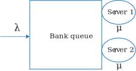
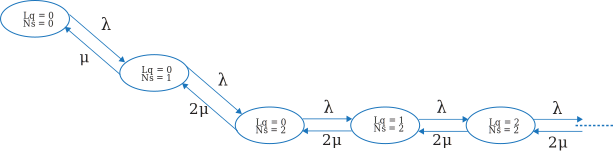
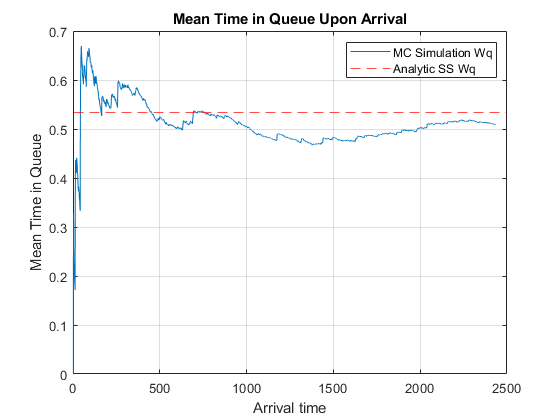
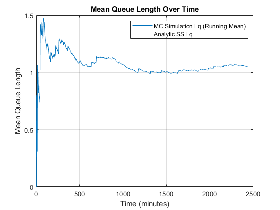
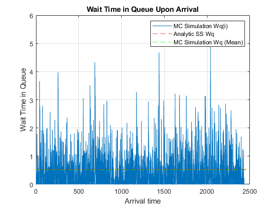
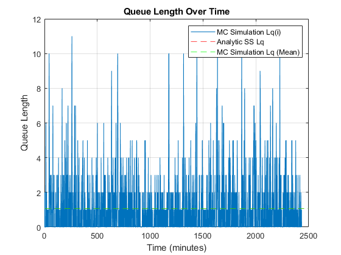
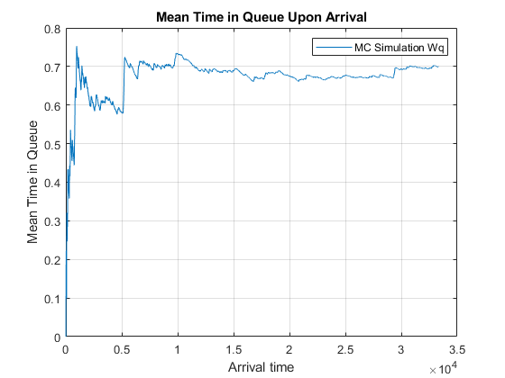
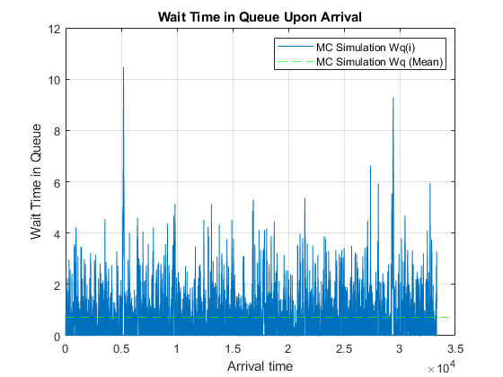
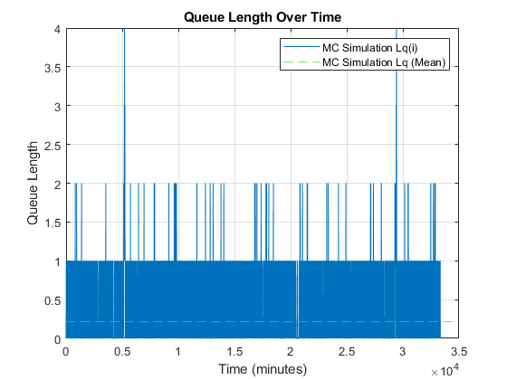

# Queueing Theory

## Problem 1 - Simple Queueing MC Simulation

**Problem Statement:** 

Consider a bank with two tellers. Assume that the arrival process is Poisson at a rate of 2 per minute and that service times are exponential with a mean of 40 seconds. It is currently 10 AM. Assume that there is sufficient capacity for any number of customers in queue and that customers are served on a first in/first out basis.

<div class="6u$"><span class="image fit"></span></div>

<div class="6u$"><span class="image fit"></span></div>

Develop a MATLAB MC simulation for the queuing system.

---

**MATLAB Code:** [problem_1.m](./problem_1.m)

Author: Yash Bansod
Date: 9th April, 2020
Problem 1 - Simple Queueing MC Simulation

GitHub: https://github.com/YashBansod

### Clear the environment and the command line

```matlab
clear;
clc;
close all;
```

### Define the input parmeters

```matlab
% Number of servers (DO NOT CHANGE) (CONSTANT FOR THIS CODE)
% ---------------------------------------------------------
num_servers = 2;
% ---------------------------------------------------------

mean_arr_rate = 2;      % Mean arrival rate (cust/min)
mean_ser_rate = 1.5;    % Mean service rate (cust/min)
num_cust = 5000;        % Number of customers
```

### Variable initializations

```matlab
service_start_time = zeros(1, num_cust);
service_time = zeros(1, num_cust);
service_end_time = zeros(1, num_cust);
```

### Calculation Module

```matlab
assert(num_servers == 2);

% Define random arrival time distribution
pd_arr = makedist('exponential', 'mu', 1/mean_arr_rate);
rand_arr_time = random(pd_arr, 1, num_cust);
cum_arr_time = cumsum(rand_arr_time);   % Arrival time in real scale

% Define random service time distribution when only one server is utilized
pd_first_ser = makedist('exponential', 'mu', 1/mean_ser_rate);
rand_f_ser_time = random(pd_first_ser, 1, num_cust);

% Define random service time distribution when both servers are utilized
pd_ser = makedist('exponential', 'mu', 1/(num_servers * mean_ser_rate));
rand_ser_time = random(pd_ser, 1, num_cust);
```

### Simulation

```matlab
% Setup the first customer
cust = 1;
service_start_time(cust) = cum_arr_time(cust);
service_time(cust) = rand_f_ser_time(cust);
service_end_time(cust) = service_start_time(cust) + service_time(cust);

% Setup the second customer
cust = 2;
service_start_time(cust) = cum_arr_time(cust);
% New customer arrives when one server is occupied
if cum_arr_time(cust) < service_end_time(cust - 1)
    service_time(cust) = rand_ser_time(cust);
% New customer arrives when both servers are free
else
    service_time(cust) = rand_f_ser_time(cust);
end
service_end_time(cust) = service_start_time(cust) + service_time(cust);


for cust = 3:1:num_cust
    % New customer arrives when both servers are occupied
    if cum_arr_time(cust) < service_end_time(cust - 2)
        service_start_time(cust) = service_end_time(cust - 2);
        service_time(cust) = rand_ser_time(cust);
    % New customer arrives when one server is occupied
    elseif cum_arr_time(cust) < service_end_time(cust - 1)
        service_start_time(cust) = service_end_time(cust - 1);
        service_time(cust) = rand_ser_time(cust);
    % New customer arrives when both servers are free
    else
        service_start_time(cust) = cum_arr_time(cust);
        service_time(cust) = rand_f_ser_time(cust);
    end
    service_end_time(cust) = service_start_time(cust) + service_time(cust);
end
```

### Post Simulation Computations

```matlab
system_time = service_end_time - cum_arr_time;
q_wait_time = service_start_time - cum_arr_time;

cum_q_wait_time = cumsum(q_wait_time);
run_mean_q_wait_time = cum_q_wait_time ./ (1:num_cust);
```

### Calculate Queue Length at differnt points in time

```matlab
delta_t = 1;                            % Time resolution is 1 minute

time_line = 0:delta_t:floor(service_end_time(end));
queue_len = zeros(size(time_line));

for time_ind = 1:size(time_line, 2)
    for cust_ind = 1:num_cust
        if (cum_arr_time(cust_ind) < time_line(time_ind) && ...
                service_end_time(cust_ind) > time_line(time_ind) && ...
                service_start_time(cust_ind) > time_line(time_ind))
            queue_len(time_ind) = queue_len(time_ind) + 1;
        end
    end
end

cum_queue_len = cumsum(queue_len);
run_mean_queue_len = cum_queue_len ./ (1:size(queue_len, 2));
```

### Analytic computations

```matlab
% util_rate = mean_arr_rate / (num_servers * mean_ser_rate);
mean_q_wait_time = run_mean_q_wait_time(end);
mean_q_length = run_mean_queue_len(end);
mean_system_time = mean(system_time);

std_q_wait_time = std(q_wait_time);
std_q_length = std(queue_len);
std_system_time = std(system_time);

ste_q_wait_time = std_q_wait_time/sqrt(size(q_wait_time, 2));
ste_q_length = std_q_length/sqrt(size(queue_len, 2));
ste_system_time = std_system_time/sqrt(size(system_time, 2));
```

### Print the computation results

```matlab
fprintf('Mean Queue Waiting Time (Wqmc): %.2f minutes\n', mean_q_wait_time)
fprintf('Mean Queue Length (Lqmc): %.2f customers \n', mean_q_length)
fprintf('Mean System Time (Wmc): %.2f minutes\n\n', mean_system_time)

fprintf('STD Queue Waiting Time (Wqmc): %.2f minutes\n', std_q_wait_time)
fprintf('STD Queue Length (Lqmc): %.2f customers \n', std_q_length)
fprintf('STD System Time (Wmc): %.2f minutes\n\n', std_system_time)

fprintf('STE Queue Waiting Time (Wqmc): %.2f minutes\n', ste_q_wait_time)
fprintf('STE Queue Length (Lqmc): %.2f customers \n', ste_q_length)
fprintf('STE System Time (Wmc): %.2f minutes\n\n', ste_system_time)
```
Mean Queue Waiting Time (Wqmc): 0.51 minutes  
Mean Queue Length (Lqmc): 1.05 customers   
Mean System Time (Wmc): 0.93 minutes  

STD Queue Waiting Time (Wqmc): 0.66 minutes  
STD Queue Length (Lqmc): 1.65 customers   
STD System Time (Wmc): 0.75 minutes  

STE Queue Waiting Time (Wqmc): 0.01 minutes  
STE Queue Length (Lqmc): 0.03 customers   
STE System Time (Wmc): 0.01 minutes  

### Plot Outcomes

```matlab
analytic_ss_queue_wait_time = 0.533;
analytic_ss_queue_len = 1.066;

figure(1)
plot(cum_arr_time, run_mean_q_wait_time)
hold on;
yline(analytic_ss_queue_wait_time, '--r');
hold off;
legend('MC Simulation Wq', 'Analytic SS Wq');
xlabel('Arrival time')
ylabel('Mean Time in Queue')
title('Mean Time in Queue Upon Arrival')
grid on;

figure(2)
plot(time_line, run_mean_queue_len)
hold on;
yline(analytic_ss_queue_len, '--r');
hold off;
legend('MC Simulation Lq (Running Mean)', 'Analytic SS Lq');
xlabel('Time (minutes)')
ylabel('Mean Queue Length')
title('Mean Queue Length Over Time')
grid on;

figure(3)
plot(cum_arr_time, q_wait_time)
hold on;
yline(analytic_ss_queue_wait_time, '--r');
yline(mean_q_wait_time, '--g');
hold off;
legend('MC Simulation Wq(i)', 'Analytic SS Wq', 'MC Simulation Wq (Mean)');
xlabel('Arrival time')
ylabel('Wait Time in Queue')
title('Wait Time in Queue Upon Arrival')
grid on;

figure(4)
plot(time_line, queue_len)
hold on;
yline(analytic_ss_queue_len, '--r');
yline(mean_q_length, '--g');
hold off;
legend('MC Simulation Lq(i)', 'Analytic SS Lq', 'MC Simulation Lq (Mean)');
xlabel('Time (minutes)')
ylabel('Queue Length')
title('Queue Length Over Time')
grid on;
```
<div><span class="image fit"></span></div>
<div><span class="image fit"></span></div>
<div><span class="image fit"></span></div>
<div><span class="image fit"></span></div>
  

---

## Problem 2 - Simple Queueing MC Simulation

Consider a G/G/1 queueing system in which the inter-arrival times and service times have a triangular distribution. Assume a minimum inter-arrival time of 2 min, a maximum inter-arrival time of 5 min, and a most likely time of 3 min. Assume a minimum service time value of 1.8 min, a maximum service time of 4.5 min, and a most likely service time of 2.8 .

Develop a MATLAB Monte Carlo Simulation for the G/G/1 problem that: 

- Determines and provides as text output the mean time a customer spends in the queue, the associated standard deviation and the associated standard error
- Plots the cumulative running mean for the queue waiting time.

---

**MATLAB Code:** [problem_2.m](./problem_2.m)

Author: Yash Bansod
Date: 17th May, 2020
Problem 2 - Simple Queueing MC Simulation

GitHub: https://github.com/YashBansod

### Clear the environment and the command line

```matlab
clear;
clc;
close all;
```

### Define the input parmeters

```matlab
arr_time_min = 2;               % Mininimum arrival time (in minutes)
arr_time_likely = 3;            % Likely arrival time (in minutes)
arr_time_max = 5;               % Maximum arrival time (in minutes)

ser_time_min = 1.8;             % Mininimum service time (in minutes)
ser_time_likely = 2.8;          % Likely service time (in minutes)
ser_time_max = 4.5;             % Maximum service time (in minutes)

num_cust = 10000;               % Number of customers
```

### Variable initializations

```matlab
service_start_time = zeros(1, num_cust);
service_end_time = zeros(1, num_cust);
```

### Calculation Module

```matlab
% Define random arrival time distribution
pd_arr = makedist('Triangular', 'a', arr_time_min, ...
                    'b', arr_time_likely, 'c', arr_time_max);
rand_arr_time = random(pd_arr, 1, num_cust);
cum_arr_time = cumsum(rand_arr_time);   % Arrival time in real scale

% Define random service time distribution
pd_ser = makedist('Triangular', 'a', ser_time_min, ...
                    'b', ser_time_likely, 'c', ser_time_max);
rand_ser_time = random(pd_ser, 1, num_cust);
```

### Simulation

```matlab
% Setup the first customer
cust = 1;
service_start_time(cust) = cum_arr_time(cust);
service_end_time(cust) = service_start_time(cust) + rand_ser_time(cust);


for cust = 2:1:num_cust
    % New customer arrives server is occupied
    if cum_arr_time(cust) < service_end_time(cust - 1)
        service_start_time(cust) = service_end_time(cust - 1);
    % New customer arrives when server is free
    else
        service_start_time(cust) = cum_arr_time(cust);
    end
    service_end_time(cust) = service_start_time(cust) + rand_ser_time(cust);
end
```

### Post Simulation Computations

```matlab
system_time = service_end_time - cum_arr_time;
q_wait_time = service_start_time - cum_arr_time;

cum_q_wait_time = cumsum(q_wait_time);
run_mean_q_wait_time = cum_q_wait_time ./ (1:num_cust);
```

### Calculate Queue Length at differnt points in time

```matlab
delta_t = 1;                            % Time resolution is 1 minute

time_line = 0:delta_t:floor(service_end_time(end));
queue_len = zeros(size(time_line));

for time_ind = 1:size(time_line, 2)
    for cust_ind = 1:num_cust
        if (cum_arr_time(cust_ind) < time_line(time_ind) && ...
                service_end_time(cust_ind) > time_line(time_ind) && ...
                service_start_time(cust_ind) > time_line(time_ind))
            queue_len(time_ind) = queue_len(time_ind) + 1;
        end
    end
end

cum_queue_len = cumsum(queue_len);
run_mean_queue_len = cum_queue_len ./ (1:size(queue_len, 2));
```

### Computations for some analysis

```matlab
mean_q_wait_time = run_mean_q_wait_time(end);
mean_q_length = run_mean_queue_len(end);
mean_system_time = mean(system_time);

std_q_wait_time = std(q_wait_time);
std_q_length = std(queue_len);
std_system_time = std(system_time);

ste_q_wait_time = std_q_wait_time/sqrt(size(q_wait_time, 2));
ste_q_length = std_q_length/sqrt(size(queue_len, 2));
ste_system_time = std_system_time/sqrt(size(system_time, 2));
```

### Print the computation results

```matlab
fprintf('Mean Queue Waiting Time (Wqmc): %.2f minutes\n', mean_q_wait_time)
fprintf('Mean Queue Length (Lqmc): %.2f customers \n', mean_q_length)
fprintf('Mean System Time (Wmc): %.2f minutes\n\n', mean_system_time)

fprintf('STD Queue Waiting Time (Wqmc): %.2f minutes\n', std_q_wait_time)
fprintf('STD Queue Length (Lqmc): %.2f customers \n', std_q_length)
fprintf('STD System Time (Wmc): %.2f minutes\n\n', std_system_time)

fprintf('STE Queue Waiting Time (Wqmc): %.2f minutes\n', ste_q_wait_time)
fprintf('STE Queue Length (Lqmc): %.2f customers \n', ste_q_length)
fprintf('STE System Time (Wmc): %.2f minutes\n\n', ste_system_time)
```
Mean Queue Waiting Time (Wqmc): 0.70 minutes  
Mean Queue Length (Lqmc): 0.21 customers   
Mean System Time (Wmc): 3.73 minutes  
  
STD Queue Waiting Time (Wqmc): 1.04 minutes  
STD Queue Length (Lqmc): 0.44 customers   
STD System Time (Wmc): 1.17 minutes  
  
STE Queue Waiting Time (Wqmc): 0.01 minutes  
STE Queue Length (Lqmc): 0.00 customers   
STE System Time (Wmc): 0.01 minutes  
  
### Plot Outcomes

```matlab
figure(1)
plot(cum_arr_time, run_mean_q_wait_time)
legend('MC Simulation Wq');
xlabel('Arrival time')
ylabel('Mean Time in Queue')
title('Mean Time in Queue Upon Arrival')
grid on;

figure(2)
plot(time_line, run_mean_queue_len)
legend('MC Simulation Lq (Running Mean)');
xlabel('Time (minutes)')
ylabel('Mean Queue Length')
title('Mean Queue Length Over Time')
grid on;

figure(3)
plot(cum_arr_time, q_wait_time)
hold on;
yline(mean_q_wait_time, '--g');
hold off;
legend('MC Simulation Wq(i)', 'MC Simulation Wq (Mean)');
xlabel('Arrival time')
ylabel('Wait Time in Queue')
title('Wait Time in Queue Upon Arrival')
grid on;

figure(4)
plot(time_line, queue_len)
hold on;
yline(mean_q_length, '--g');
hold off;
legend('MC Simulation Lq(i)', 'MC Simulation Lq (Mean)');
xlabel('Time (minutes)')
ylabel('Queue Length')
title('Queue Length Over Time')
grid on;
```
<div><span class="image fit"></span></div>
<div><span class="image fit"></span></div>
<div><span class="image fit"></span></div>
<div><span class="image fit"></span></div>